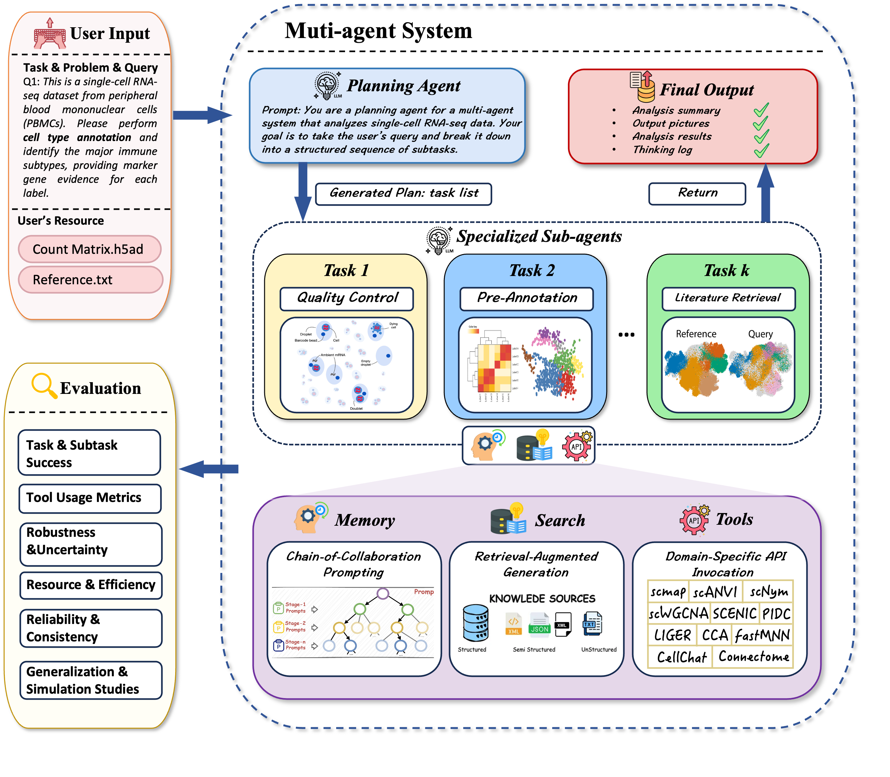
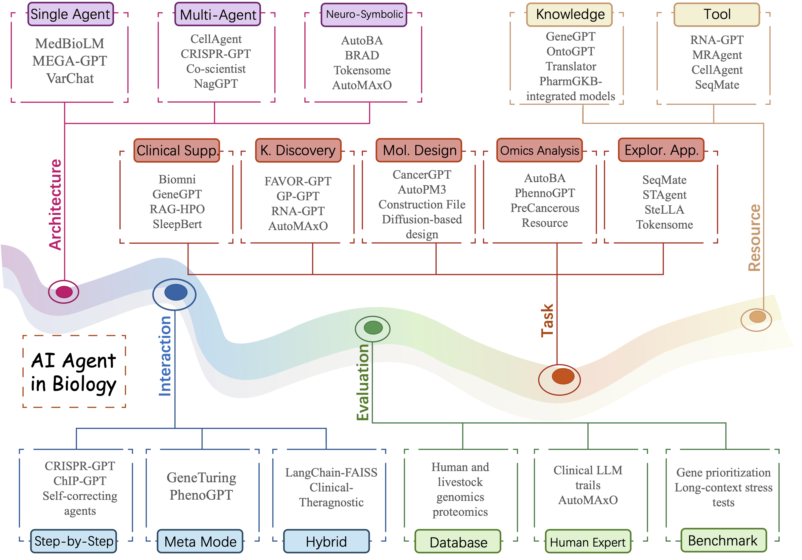

# AI Agents in Biology

This repository is a companion resource for the paper:

> **AI Agent in Biology Research: A Survey**  
> Cong Qi*, Wenbo Wang*, Siqi Jiang, Qin Liu, Xun Song, Hanzhang Fang, Zhi Wei  
> *Submitted to Briefings in Bioinformatics*

This repository organizes representative **biological AI agent systems**
according to the **five-dimensional taxonomy** proposed in the paper.
It is designed as a **living, continuously updated reference resource**
for both computer science and biology researchers.

---



<!-- ## Taxonomy

 -->


---

## 📑 Table of Contents

- [Overview: Five-Dimensional Taxonomy](#overview-five-dimensional-taxonomy)
- [1. Biological Task Domains](#1-biological-task-domains)
  - [Clinical Decision Support](#clinical-decision-support)
  - [Knowledge Discovery and Hypothesis Generation](#knowledge-discovery-and-hypothesis-generation)
  - [Molecular and Drug Design](#molecular-and-drug-design)
  - [Multi-omics Analysis](#multi-omics-analysis)
  - [Exploratory Applications](#exploratory-applications)
- [2. System Architecture](#2-system-architecture)
  - [Single-Agent Systems](#single-agent-systems)
  - [Multi-Agent Systems](#multi-agent-systems)
  - [Neuro-Symbolic Integration](#neuro-symbolic-integration)
- [3. Evaluation Strategy](#3-evaluation-strategy)
- [4. Interaction Mode](#4-interaction-mode)
- [5. Resource Integration](#resource-integration)
  - [Knowledge-augmented Agents](#knowledge-augmented-agents)
  - [Tool-augmented Agents](#tool-augmented-agents)
- [Benchmarks](#benchmark)
- [Maintenance and Updates](#maintenance-and-updates)
- [Citation](#citation)

---

## Overview: Five-Dimensional Taxonomy

We organize existing biological AI agent research along five dimensions:

1. **Biological Task Domains**  
2. **System Architectures**  
3. **Interaction Modes**  
4. **Evaluation Strategies**  
5. **Resource Integration**

Each section lists representative systems with concise bibliographic
information and direct links to the original publications.

---

## 1. Biological Task Domains

This dimension categorizes AI agents by the biological problems they address.

### Clinical Decision Support

- **[Leveraging Large Language Models for Decision Support in Personalized Oncology](https://jamanetwork.com/journals/jamanetworkopen/fullarticle/2812097#google_vignette)** (*2023*) `JAMA Network Open`
  > This study evaluates four large language models as assistants in precision oncology by comparing their treatment recommendations with those of human experts. While the models produced more candidate treatment options, their agreement with expert decisions was low due to limited supporting evidence, though some clinically useful and unique suggestions emerged. The findings suggest LLMs may support idea generation and literature screening but cannot replace expert judgment.


- **[SensitiveCancerGPT: Leveraging Generative Large Language Model on Structured Omics Data to Optimize Drug Sensitivity Prediction](https://pmc.ncbi.nlm.nih.gov/articles/PMC11888479/)** (*2025*) `bioRxiv`
  > This work explores the use of generative large language models for drug sensitivity prediction from structured pharmacogenomics data. With domain specific prompt engineering and fine tuning, GPT achieved strong performance and generalization across multiple datasets, outperforming established baselines in several settings. The results indicate that generative LLMs can serve as effective computational tools to support precision oncology research.

- **[CART-GPT: A T Cell-Informed AI Linguistic Framework for Interpreting Neurotoxicity and Therapeutic Outcomes in CAR-T Therapy](https://pmc.ncbi.nlm.nih.gov/articles/PMC12363796//)** (*2025*) `bioRxiv`
  > This paper introduces CART-GPT, a transformer-based model trained on over one million CAR-T single-cell RNA-seq profiles to predict patient-specific treatment response and neurotoxicity risk in CAR-T therapy. The model achieves strong predictive performance while providing interpretable insights showing that outcomes are driven by coordinated subsets of T cell states rather than single cell types. By linking single-cell predictions to patient-level outcomes and releasing a large annotated atlas, the study demonstrates the value of foundation models for precision CAR-T treatment planning.


- **[Exploring the Potential of AI-powered Applications for Clinical Decision-making in Gynecologic Oncology](https://obgyn.onlinelibrary.wiley.com/doi/abs/10.1002/ijgo.70251)** (*2025*) `International Journal of Gynecology & Obstetrics`
  > This study evaluates GPT-4 for automated therapy recommendations by comparing its suggestions with multidisciplinary tumor board decisions for gynecologic and breast cancer cases. GPT-4 generated coherent and clinically reasonable recommendations, though limitations in accuracy and completeness remained, particularly in surgical and systemic treatment choices. Iterative prompting substantially improved concordance with expert decisions, indicating that GPT-4 may serve as a supportive tool in clinical decision making rather than a replacement for physicians.


- **[Chatbot for the Return of Positive Genetic Screening Results for Hereditary Cancer Syndromes: A Prompt Engineering Project](https://cancer.jmir.org/2025/1/e65848)** (*2025*) `JMIR Cancer`
  > This study designs and evaluates a GPT-4 powered chatbot to support the return of positive population wide genomic screening results in a large public health program. Expert evaluation shows that the chatbot provides clear, user friendly, and contextually appropriate communication, performing well in tone, usability, and boundary management, though program specific accuracy requires improvement. The findings demonstrate the feasibility of LLM based chatbots to augment genetic counseling services and improve the accessibility of genomic health care.


- **[Evaluating the Use of Generative Artificial Intelligence to Support Genetic Counseling for Rare Diseases](https://www.mdpi.com/2075-4418/15/6/672)** (*2025*) `Diagnostics`
  > This study evaluates four generative AI models for answering rare disease and genetic counseling questions, focusing on accuracy and safety. While all models generally provided reliable and professional information, performance varied, with ChatGPT scoring highest and Perplexity showing the most low quality responses. The results highlight the potential value of generative AI in supporting patients and families, while emphasizing the need for expert oversight to mitigate inaccuracies and ambiguity.


- **[Innovations in Medicine: Exploring ChatGPT’s Impact on Rare Disorder Management](https://www.mdpi.com/2073-4425/15/4/421)** (*2024*) `Genes`
  > This review examines the role of AI, particularly ChatGPT, in advancing research, education, and clinical practice for rare and genetic disorders. It highlights the potential of AI to improve personalized patient care while critically discussing current limitations and risks. The study outlines future directions for developing AI tools that can better support healthcare professionals and patients in rare disease management.


- **[Importance of Prior Patient Interactions With the Healthcare System to Engaging With Pretest Cancer Genetic Services via Digital Health Tools Among Unaffected Primary Care Patients: Findings From the BRIDGE Trial](https://onlinelibrary.wiley.com/doi/full/10.1111/1475-6773.14652)** (*2025*) `Health Services Research`
  > This randomized trial examined factors associated with opening patient portal messages about cancer genetic services and initiating pretest genetic care. Engagement was strongly driven by prior interaction with the healthcare system, such as frequent portal use and primary care visits, while sociodemographic and clinical characteristics showed no significant effects. The findings suggest that improving access to healthcare and digital tools may be key to increasing uptake of cancer genetic services.


- **[Improving Automated Deep Phenotyping Through Large Language Models Using Retrieval Augmented Generation](https://link.springer.com/article/10.1186/s13073-025-01521-w)** (*2025*) `Genome Medicine`
  > This study introduces RAG-HPO, a retrieval augmented generation approach that improves automatic extraction of Human Phenotype Ontology terms from clinical text using large language models. By combining LLMs with a curated phenotype database, RAG-HPO substantially outperforms existing rule based tools in precision, recall, and F1 score while minimizing hallucinations. The results demonstrate that retrieval guided LLMs can provide accurate and reliable phenotype extraction for rare disease diagnosis and clinical genomics research.


- **[GeneGPT: Augmenting Large Language Models with Domain Tools for Improved Access to Biomedical Information](https://academic.oup.com/bioinformatics/article/40/2/btae075/7606338)** (*2024*) `Bioinformatics`
  > This work presents GeneGPT, a framework that enables large language models to answer genomics questions by directly invoking NCBI Web APIs. By learning to generate and execute API calls through in-context learning and augmented decoding, GeneGPT substantially reduces hallucinations and achieves state-of-the-art performance on the GeneTuring benchmark. The results demonstrate that tool-augmented LLMs can reliably perform complex and multi-hop reasoning in genomics tasks.


- **[Assessing the Utility of Large Language Models for Phenotype-Driven Gene Prioritization in Rare Genetic Disorder Diagnosis](https://www.cell.com/ajhg/fulltext/S0002-9297(24)00296-9)** (*2024*) `The American Journal of Human Genetics`
  > This study evaluates multiple large language models for phenotype driven gene prioritization in rare disease diagnosis across different prompts, input types, and task settings. Although GPT 4 performed best, its accuracy remained substantially lower than that of traditional gene prioritization tools, with limited benefit from retrieval augmentation or few shot learning. The findings highlight both the potential and current limitations of LLMs in clinical genomic workflows, including biases toward well studied genes.


- **[A Comparative Evaluation of ChatGPT 3.5 and ChatGPT 4 in Responses to Selected Genetics Questions](https://pubmed.ncbi.nlm.nih.gov/38872284/)** (*2024*) `Journal of the American Medical Informatics Association`
  > This study evaluates GPT-4’s ability to deliver genetic information on BRCA1, HFE, and MLH1 compared with GPT-3.5 using expert review by genetic counselors and clinicians. GPT-4 showed significantly improved accuracy and generally favorable relevance, but persistent errors and usability limitations remained. The findings highlight GPT-4’s promise in genetic education while emphasizing the need for continued refinement and ethical oversight in clinical use.


- **[Biomni: A General-Purpose Biomedical AI Agent](https://pmc.ncbi.nlm.nih.gov/articles/PMC12157518/)** (*2025*) `bioRxiv`
  > This paper introduces Biomni, a general purpose biomedical AI agent designed to autonomously execute complex research tasks across diverse biomedical domains. By integrating large language model reasoning with retrieval augmented planning and code based execution, Biomni demonstrates strong generalization across tasks such as gene prioritization, drug repurposing, and rare disease diagnosis without task specific tuning. The results suggest that agentic AI systems can substantially enhance biomedical research productivity and support human scientists in complex discovery workflows.


- **[BioLab: End-to-End Autonomous Life Sciences Research with Multi-Agents System Integrating Biological Foundation Models](https://www.biorxiv.org/content/10.1101/2025.09.03.674085v1.abstract)** (*2025*) `bioRxiv`
  > This paper presents BioLab, a multi agent system that integrates domain specific foundation models and computational tools to automate end to end biological research. BioLab outperforms leading large language models on biomedical reasoning benchmarks and autonomously executes complex pipelines, including de novo antibody design with experimental validation. The results demonstrate that AI native multi agent frameworks can tightly couple computation and experimentation to drive scalable scientific discovery.


- **[SleepBert: An Intelligent Clinical Encyclopaedia for Sleep Disorders Using Large Language Models](https://pmc.ncbi.nlm.nih.gov/articles/PMC12083639/)** (*2025*) `Research Square`
  > This paper introduces SleepBert, a retrieval augmented model that integrates structured polysomnography features with unstructured clinical narratives for comprehensive sleep disorder analysis. By fine tuning ClinicalBERT and incorporating real time medical literature retrieval, SleepBert achieves substantially higher diagnostic accuracy than existing baselines. The system supports scalable and evidence based interpretation of complex sleep data to assist clinical decision making and research.


- **[Approximating facial expression effects on diagnostic accuracy via generative AI in medical genetics](https://academic.oup.com/bioinformatics/article/40/Supplement_1/i110/7700869)** (*2024*) `Bioinformatics`
  > This study examines how facial expressions influence AI and human diagnosis of genetic syndromes using facial images. Both deep learning models and clinicians were more likely to correctly identify Williams and Angelman syndromes when individuals were smiling, revealing a bias linked to stereotypical expressions, while no such effect was observed for other syndromes. The findings highlight facial expression as an important confounder that should be considered and mitigated in AI driven genomic and clinical diagnostics.


- **[Can Large Language Models Democratize Access to Dual-use Biotechnology?](https://arxiv.org/abs/2306.03809)** (*2023*) `Arxiv`
  > This study shows that large language model chatbots can rapidly guide non experts toward accessing and developing pandemic capable pathogens by providing actionable technical guidance, materials sourcing, and procedural details. The findings highlight a serious dual use risk in current LLM deployments, suggesting that such models could lower barriers to biological harm. The authors emphasize the need for strong safeguards, including third party model evaluation, dataset curation, and comprehensive DNA synthesis screening.


- **[Artificial Intelligence in Clinical Genetics](https://www.nature.com/articles/s41431-024-01782-w)** (*2025*) `European Journal of Human Genetics`
  > This review surveys past, current, and emerging applications of artificial intelligence in clinical genetics, spanning diagnostics, patient management, therapeutics, and clinical support. It outlines key AI categories, including machine learning, deep learning, and generative AI, and discusses their evolving roles in genetic practice. The authors argue that AI is likely to substantially transform clinical genetics and emphasize the need for proactive preparation to balance benefits and risks.


- **[Advancing Healthcare: The Role and Impact of AI and Foundation Models](https://pmc.ncbi.nlm.nih.gov/articles/PMC11236664/)** (*2024*) `American Journal of Translational Research`
  > This review examines the evolution of foundation AI models in healthcare, highlighting their growing impact on diagnostics, medical interventions, and precision medicine across domains such as imaging, genomics, and decision support. It discusses both the transformative potential of generative and traditional AI models and the challenges of slow adoption, ethics, bias, and governance in healthcare systems. The authors advocate for transparent, fair, and accountable AI frameworks, including the concept of General Medical AI, to enable scalable and responsible healthcare innovation.


- **[Intuitive Human–Artificial Intelligence Theranostic Complementarity](https://www.liebertpub.com/doi/full/10.1089/cbr.2025.0021)** (*2025*) `Cancer Biotherapy & Radiopharmaceuticals`
  > This paper argues that while deep learning excels at radiomics and image based analysis in radiology and nuclear medicine, generative AI is fundamentally limited in clinical decision making because it lacks understanding, judgment, and empathy. The authors emphasize that AI should complement rather than replace nuclear physicians, whose intuition, accountability, and patient centered reasoning remain essential. A synergistic human–AI approach is proposed to support personalized and empathetic theranostic cancer care.


### Knowledge Discovery and Hypothesis Generation

<!-- 
- **[Assessing the Performance of Generative Artificial Intelligence in Retrieving Information against Manually Curated Genetic and Genomic Data](https://academic.oup.com/database/article/doi/10.1093/database/baaf011/8019548)** (*2025*) `Database`
  > The paper presents Foam - Agent, a multi - agent framework automating CFD workflows from natural language. It features unique retrieval, file - generation and error - correction systems, lowering expertise barriers.


- **[Characterization and Automated Classification of Sentences in the Biomedical Literature: A Case Study for Biocuration of Gene Expression and Protein Kinase Activity](https://pmc.ncbi.nlm.nih.gov/articles/PMC11741306)** (*2025*) `bioRxiv`
  > The paper presents Foam - Agent, a multi - agent framework automating CFD workflows from natural language. It features unique retrieval, file - generation and error - correction systems, lowering expertise barriers.


- **[Generative Artificial Intelligence GPT-4 Accelerates Knowledge Mining and Machine Learning for Synthetic Biology](https://pubs.acs.org/doi/full/10.1021/acssynbio.3c00310)** (*2023*) `ACS synthetic biology`
  > The paper presents Foam - Agent, a multi - agent framework automating CFD workflows from natural language. It features unique retrieval, file - generation and error - correction systems, lowering expertise barriers.


- **[Network for Knowledge Organization (NEKO): An AI Knowledge Mining Workflow for Synthetic Biology Research](https://www.sciencedirect.com/science/article/pii/S1096717624001484)** (*2025*) `Metabolic Engineering`
  > The paper presents Foam - Agent, a multi - agent framework automating CFD workflows from natural language. It features unique retrieval, file - generation and error - correction systems, lowering expertise barriers. -->


- **[Leveraging Generative AI to Assist Biocuration of Medical Actions for Rare Disease](https://academic.oup.com/bioinformaticsadvances/article/5/1/vbaf141/8160944)** (*2025*) `Bioinformatics Advances`
  > This paper presents AutoMAxO, a semi automated framework that uses large language models to scale the biocuration of medical actions for rare diseases. By extracting candidate treatments from literature and aligning them with MAxO, HPO, and MONDO ontologies before human review, AutoMAxO substantially reduces manual curation burden. Applied to 37 rare genetic diseases, the approach identified hundreds of novel treatment annotations, demonstrating the utility of LLM assisted curation in translational research.


- **[FAVOR-GPT: A Generative Natural Language Interface to Whole Genome Variant Functional Annotations](https://academic.oup.com/bioinformaticsadvances/article/4/1/vbae143/7789482)** (*2024*) `Bioinformatics Advances`
  > This work introduces FAVOR-GPT, a retrieval augmented generative interface that integrates large language models with the FAVOR database to support interpretation of whole genome variant annotations. By translating complex functional annotations into user friendly summaries, FAVOR-GPT improves accessibility and usability for researchers without specialized expertise. The results demonstrate that RAG based LLM interfaces can effectively enhance genomic data interpretation while maintaining high annotation accuracy.


- **[GP-GPT: Large Language Model for Gene-phenotype Mapping](https://arxiv.org/abs/2409.09825)** (*2024*) `arXiv`
  > This work introduces GP-GPT, a specialized large language model fine-tuned on large scale genomics, proteomics, and medical genetics data for genetic–phenotype knowledge representation and relation analysis. GP-GPT outperforms general purpose LLMs on genomics information retrieval and relationship determination tasks, demonstrating strong domain specific understanding. The results suggest that tailored LLMs can more effectively support gene–phenotype research and biomedical knowledge discovery.


- **[SpatialAgent: An Autonomous AI Agent for Spatial Biology](https://www.biorxiv.org/content/10.1101/2025.04.03.646459v1.abstract)** (*2025*) `bioRxiv`
  > This paper introduces SpatialAgent, a fully autonomous AI agent designed to support end to end spatial biology research by integrating large language models with adaptive reasoning and dynamic tool use. Evaluated on large scale human and mouse spatial datasets, SpatialAgent outperforms existing computational methods and matches or exceeds human performance on key tasks. The study demonstrates a new paradigm for scalable and collaborative AI driven discovery in spatial biology.


- **[PCMR: A Comprehensive Precancerous Molecular Resource](https://www.nature.com/articles/s41597-025-04899-9)** (*2025*) `Scientific Data`
  > This study introduces the PreCancerous Molecular Resource (PCMR), a large integrated database compiling multi-omics molecular profiles of precancerous lesions across diverse cancer types and tissues. By combining differential analysis with ChatGPT-based text mining, PCMR systematically identifies precancer–gene associations and validates their biological and clinical relevance. The resource provides a comprehensive foundation for studying early carcinogenesis and advancing precancer research and intervention.


- **[Uncertainty-Aware Adaptation of Large Language Models for Protein-Protein Interaction Analysis](https://arxiv.org/abs/2502.06173)** (*2025*) `arXiv`
  > This study introduces an uncertainty-aware framework for protein–protein interaction prediction using fine-tuned large language models. By integrating LoRA ensembles and Bayesian LoRA for uncertainty quantification, the approach improves the reliability and reproducibility of LLM-based PPI analysis across multiple disease contexts. The results highlight the importance of confidence-aware modeling for trustworthy applications of LLMs in precision medicine and computational biology.


- **[CRISPR-GPT for agentic automation of gene-editing experiments](https://www.nature.com/articles/s41551-025-01463-z)** (*2025*) `Nature Biomedical Engineering`
  > This work presents CRISPR-GPT, an LLM-based agent system designed to support end-to-end CRISPR gene-editing experiment design and data analysis. By integrating domain knowledge, retrieval, external tools, and a fine-tuned model, CRISPR-GPT assists with experimental planning, guide RNA design, protocol drafting, and result interpretation. Experimental validations demonstrate its effectiveness as an AI co-pilot for genome engineering across different CRISPR modalities.


- **[MRAgent: An LLM-based Automated Agent for Causal Knowledge Discovery in Disease via Mendelian Randomization](https://academic.oup.com/bib/article/26/2/bbaf140/8107848)** (*2025*) `Briefings in Bioinformatics`
  > This paper introduces MRAgent, an automated LLM-based agent that facilitates large-scale Mendelian randomization analysis by autonomously identifying exposure–outcome pairs from the literature and performing causal inference using GWAS data. By reducing reliance on prior expert knowledge, MRAgent streamlines causal discovery in disease research and demonstrates an end-to-end workflow through automated and human evaluations. The results highlight the potential of LLM-powered agents to advance causal analysis in complex biomedical studies.


- **[Evaluating GPT and BERT Models for Protein-Protein Interaction Identification in Biomedical Text](https://academic.oup.com/bioinformaticsadvances/article/4/1/vbae133/7755482)** (*2024*) `Bioinformatics Advances`
  > This study evaluates transformer-based language models for extracting protein–protein interactions from biomedical text. Bidirectional encoder models, especially BioBERT, achieved the strongest overall performance, while GPT-4 demonstrated comparable precision and recall despite not being specifically trained on biomedical corpora. The results indicate that large language models can effectively support automated PPI mining from the biomedical literature.


- **[Generative Artificial Intelligence GPT-4 Accelerates Knowledge Mining and Machine Learning for Synthetic Biology](https://pubs.acs.org/doi/full/10.1021/acssynbio.3c00310)** (*2023*) `ACS synthetic biology`
  > This work demonstrates how GPT-4–based prompt engineering can streamline knowledge extraction from synthetic biology literature. By mining 176 publications on oleaginous yeasts, the authors converted unstructured text into structured datasets that enabled machine-learning models to accurately predict fermentation performance. The results show that generative AI can significantly reduce manual curation effort, support predictive modeling in biomanufacturing, and enable transfer learning to less-studied microbial systems.


- **[AI-driven Toolset for IPF and Aging Research Associates Lung Fibrosis with Accelerated Aging](https://www.biorxiv.org/content/10.1101/2025.01.09.632065v1.abstract)** (*2025*) `bioRxiv`
  > This study applies AI to uncover aging-related mechanisms underlying idiopathic pulmonary fibrosis by combining a pathway-aware proteomic aging clock with a domain-specific language model, ipf-P3GPT. The aging clock shows strong predictive performance and links accelerated aging to severe COVID-19, while molecular analyses reveal that IPF reflects dysregulated aging pathways rather than simple aging acceleration. These results highlight new connections between aging biology and IPF and demonstrate the value of AI-guided strategies for studying age-related diseases.


- **[Intuitive Human–Artificial Intelligence Theranostic Complementarity](https://www.liebertpub.com/doi/full/10.1089/cbr.2025.0021)** (*2025*) `Cancer Biotherapy & Radiopharmaceuticals`
  > Deep learning has the potential to transform radiology and nuclear medicine by delivering faster and more reliable image analysis than humans, but the role of generative AI in clinical decision making remains controversial. AI lacks understanding, judgment, and empathy, so its outputs must be interpreted and applied by nuclear physicians who retain responsibility for patient care. Used in a complementary manner, AI can support precision theranostics by integrating radiomics, genomics, and clinical data while enabling physicians to focus on informed, patient-centered treatment decisions.


### Molecular and Drug Design

- **[CancerGPT for few shot drug pair synergy prediction using large pretrained language models](https://www.nature.com/articles/s41746-024-01024-9)** (*2024*) `npj Digital Medicine`
  > Large language models show strong few-shot learning ability, but their capacity to generalize to complex biological problems remains underexplored. This study proposes a few-shot LLM-based approach for predicting drug pair synergy in rare cancer tissues by leveraging prior knowledge from text rather than structured data. Experiments across seven rare tissues demonstrate that the compact CancerGPT model achieves high accuracy with minimal or no samples, performing comparably to much larger fine-tuned GPT-3 models.


- **[AutoPM3: Enhancing Variant Interpretation via LLM-driven PM3 Evidence Extraction from Scientific Literature](https://academic.oup.com/bioinformatics/advance-article-abstract/doi/10.1093/bioinformatics/btaf382/8178584)** (*2025*) `Bioinformatics`
  > This paper introduces AutoPM3, an automated framework that extracts ACMG/AMP PM3 variant evidence from biomedical literature to support rare disease diagnosis. Using open-source LLMs combined with a Text2SQL-based variant extractor and a retrieval-augmented generation module, AutoPM3 efficiently processes both text and tables. Evaluated on the newly curated PM3-Bench dataset, the method achieves high accuracy and recall, outperforming approaches that rely on larger models. The results show that open-source LLMs can provide fast, cost-effective, and scalable solutions for literature-based variant interpretation.


- **[Generative Design of Functional Metal Complexes Utilizing the Internal Knowledge of Large Language Models](https://arxiv.org/abs/2410.18136)** (*2024*) `arXiv`
  > Designing transition metal complexes involves searching an enormous chemical space, which limits the effectiveness of traditional genetic algorithms. This work introduces an LLM driven evolutionary optimization framework that leverages pretrained chemical knowledge to guide single and multi objective optimization without supervised fine tuning. The proposed approach efficiently identifies top performing complexes, enables flexible natural language driven optimization, and demonstrates strong potential for chemistry and materials design.


- **[Automatic Biomarker Discovery and Enrichment with BRAD](https://academic.oup.com/bioinformatics/article-abstract/41/5/btaf159/8125018)** (*2025*) `Bioinformatics`
  > Integrating large language models with biomedical research tools raises challenges in transparency, reproducibility, and data provenance. This work introduces BRAD, an agent-based system that combines LLMs with external tools and databases to automate research workflows while maintaining transparent and reliable protocols. Applied to biomarker discovery and other tasks, BRAD enables contextualized interpretation and automation that exceed conventional bioinformatics tools.


- **[Can large language models democratize access to dual-use biotechnology?](https://arxiv.org/abs/2306.03809)** (*2023*) `arXiv`
  > Large language models are accelerating and democratizing research by providing accessible expertise across disciplines, but they also risk lowering barriers to dual use technologies with serious biosecurity implications. An educational experiment showed that, with minimal prompting, chatbots could guide non experts through key steps related to pandemic scale agents, indicating that such capabilities may become broadly accessible. These findings highlight the urgent need for safeguards such as third party model evaluation, careful curation of training data, and comprehensive DNA synthesis screening to mitigate misuse risks.


### Multi-omics Analysis


- **[Conversational AI agent for precision oncology: AI-HOPE-WNT integrates clinical and genomic data to investigate WNT pathway dysregulation in colorectal cancer](https://www.medrxiv.org/content/10.1101/2025.05.07.25327180.abstract)** (*2025*) `Frontiers in Artificial Intelligence`
  > AI-HOPE-WNT is a conversational AI agent designed to enable natural-language, WNT-focused analysis of integrated clinical and genomic colorectal cancer data. The system accurately reproduces published findings on WNT pathway alterations while uncovering new associations related to survival, treatment response, mutation co-occurrence, and population-specific risk. By automating complex bioinformatics workflows, AI-HOPE-WNT lowers technical barriers and establishes a pathway-specific paradigm for precision oncology research.


- **[BioDiscoveryAgent: An AI Agent for Designing Genetic Perturbation Experiments](https://arxiv.org/abs/2405.17631)** (*2024*) `arXiv`
  > BioDiscoveryAgent is an LLM-based autonomous agent that designs and evaluates genetic perturbation experiments by reasoning over biological knowledge without requiring explicit optimization objectives or model training. Across multiple datasets, it substantially outperforms Bayesian optimization baselines in identifying relevant genes and gene combinations, including challenging non-essential perturbation tasks and unseen data. By integrating literature search, data analysis, and self-critique, BioDiscoveryAgent offers an interpretable and efficient paradigm for closed-loop biological experiment design.


- **[Exploring new drug treatment targets for immune related bone diseases using a multi omics joint analysis strategy](https://www.nature.com/articles/s41598-025-94053-7)** (*2025*) `Scientific Reports`
  > This study applies an integrated multi-omic Mendelian randomization framework to identify causal plasma protein targets for immune-related bone diseases. By combining MR, SMR, Bayesian colocalization, LDSC, and downstream network and drug analyses, the authors systematically uncover disease-specific therapeutic targets across rheumatoid arthritis, multiple sclerosis, psoriatic arthritis, and Crohn’s disease–related arthritis. The results provide robust genetic evidence for key proteins underlying disease pathogenesis and offer a strong foundation for precision drug discovery in immune-associated bone disorders.


- **[Multimodal cell maps as a foundation for structural and functional genomics](https://www.nature.com/articles/s41586-025-08878-3)** (*2025*) `Nature`
  > This work presents a comprehensive map of human subcellular architecture by integrating biophysical interaction data and immunofluorescence imaging for over 5,100 proteins. Using self-supervised multimodal learning and large language model–assisted annotation, the study identifies hundreds of molecular assemblies, reveals new protein functions, decodes cancer-associated alterations, and provides a public platform for structural and functional cell biology research.


- **[PCMR: A Comprehensive Precancerous Molecular Resource](https://www.nature.com/articles/s41597-025-04899-9)** (*2025*) `Scientific Data`
  > This study introduces PCMR, a comprehensive, well-curated resource integrating multi-omic molecular signatures from over 25,000 precancerous samples across 35 cancer types and 20 tissues. By combining large-scale omics data with ChatGPT-assisted text mining, PCMR systematically maps precancer–gene associations and validates their biological and clinical relevance, providing a valuable foundation for advancing precancer research and early cancer intervention.


- **[Using ChatGPT to predict the future of personalized medicine](https://www.nature.com/articles/s41397-023-00316-9)** (*2023*) `The Pharmacogenomics Journal`
  > This study explores the potential role of ChatGPT in the future of personalized medicine and pharmacogenomics, highlighting a shift toward algorithm-driven, multi-omic–informed individualized therapies. While ChatGPT predicts substantial benefits for improving patient outcomes and transforming clinical decision-making, it also acknowledges current limitations that must be addressed before widespread clinical adoption.


- **[Generative Methods for Pediatric Genetics Education](https://pmc.ncbi.nlm.nih.gov/articles/PMC10543060/)** (*2023*) `medRxiv`
  > This study evaluates whether generative AI–created images can support medical education by helping pediatric residents recognize genetic syndromes. While AI-generated images performed comparably to real images, they were perceived as slightly less helpful, with real images remaining the preferred learning tool. The findings suggest that generative AI images can serve as a useful adjunct, particularly for teaching less familiar genetic conditions.


- **[Automated Bioinformatics Analysis via AutoBA](https://arxiv.org/abs/2309.03242)** (*2023*) `arXiv`
  > This work introduces AutoBA, an autonomous large language model–based agent that streamlines conventional omics data analysis with minimal user input. Validated by expert bioinformaticians, AutoBA demonstrates robust performance and adaptability across diverse modalities, including WGS, RNA-seq, single-cell, ChIP-seq, and spatial transcriptomics, while preserving data privacy through local execution. The system’s ability to dynamically design analysis workflows highlights its potential as a flexible alternative to predefined bioinformatics pipelines.


- **[PheNormGPT: a framework for extraction and normalization of key medical findings](https://academic.oup.com/database/article-abstract/doi/10.1093/database/baae103/7833209)** (*2024*) `Database`
  > This work introduces PheNormGPT, a large language model–based framework for extracting and normalizing phenotypic findings from unstructured clinical text to Human Phenotype Ontology concepts. Using fine-tuned GPT models and a novel adaptive few-shot selection strategy, PheNormGPT achieved state-of-the-art performance in the BioCreative VIII phenotype extraction challenge. The results demonstrate the effectiveness of LLM-driven approaches for accurate clinical phenotype normalization.


### Exploratory Applications


- **[Spatial transcriptomics AI agent charts hPSC-pancreas maturation in vivo](https://www.biorxiv.org/content/10.1101/2025.04.01.646731.abstract)** (*2025*) `bioRxiv`
  > This work introduces STAgent, an autonomous multimodal AI agent that integrates large language models with specialized computational tools to automate complex spatial transcriptomics analyses. Applied to human stem cell–derived pancreatic tissues, STAgent rapidly uncovers spatial maturation patterns, cell–cell interactions, and underlying biological mechanisms while contextualizing findings with relevant literature. The results demonstrate a new agentic paradigm that dramatically reduces analysis time and expertise barriers in spatial biology research.


- **[SeqMate: A Novel Large Language Model Pipeline for Automating RNA Sequencing](https://arxiv.org/abs/2407.03381)** (*2024*) `arXiv`
  > This work introduces SeqMate, a large language model–powered tool that enables one-click RNA-seq and single-cell RNA-seq analysis for non-expert users. By automating data preparation, downstream analyses, and result interpretation with literature-linked reporting, SeqMate removes technical barriers inherent to command-line pipelines and lowers the entry threshold for biological data analysis.


- **[SteLLA: A Structured Grading System Using LLMs with RAG](https://ieeexplore.ieee.org/abstract/document/10825385/)** (*2024*) `IEEE Big Data`
  > This work introduces SteLLA, a structured grading framework that combines retrieval-augmented generation with large language models to improve the reliability of automated short answer grading. By grounding evaluation in instructor-provided reference answers and rubrics, SteLLA achieves strong agreement with human graders while producing detailed, point-by-point grades and feedback. The analysis shows that LLMs accurately capture factual content but may over-infer implications, offering insights into safe and effective deployment for educational assessment.


- **[Explaining Genetic Programming Trees using Large Language Models](https://arxiv.org/abs/2403.03397)** (*2024*) `arXiv`
  > This study introduces GP4NLDR, an explainable AI framework that integrates genetic programming–based nonlinear dimensionality reduction with a large language model–powered chatbot. By combining an XAI dashboard with LLM-generated explanations, the system provides intuitive, user-centered interpretations of high-dimensional data transformations. The results demonstrate the potential of LLMs to enhance the explainability and usability of genetic programming methods.


- **[Enhancing phenotype recognition in clinical notes using large language models: PhenoBCBERT and PhenoGPT](https://www.cell.com/patterns/fulltext/S2666-3899(23)00288-X)** (*2023*) `Patterns`
  > This study develops PhenoBCBERT and PhenoGPT, two large language model–based approaches for automated phenotype recognition in clinical notes by expanding Human Phenotype Ontology vocabularies. The models outperform traditional rule-based tools by identifying a broader and more nuanced range of phenotype concepts, including previously uncharacterized terms, and demonstrate strong performance across clinical text and biomedical literature. These results highlight the effectiveness of adapting general-purpose LLMs for domain-specific clinical and genetic research.


- **[A Comprehensive Survey of Foundation Models in Medicine](https://ieeexplore.ieee.org/abstract/document/10847310)** (*2025*) `IEEE Reviews in Biomedical Engineering`
  > This survey provides a comprehensive review of foundation models (FMs) in medicine, covering their evolution, learning strategies, flagship models, applications, and challenges across healthcare. It systematically examines how models such as BERT and GPT are transforming clinical NLP, medical imaging, and omics research, and proposes a detailed taxonomy of FM-enabled medical applications. The survey also discusses key limitations, open research questions, and lessons learned to support responsible and effective deployment of FMs in healthcare.


- **[Regulatory barriers to USChina collaboration for generative AI development in genomic research](https://www.cell.com/cell-genomics/fulltext/S2666-979X(24)00130-7)** (*2024*) `Cell Genomics`
  > This article analyzes how U.S. and Chinese regulatory frameworks create barriers to collaboration in generative-AI–assisted genomic research, particularly around data sharing, security, and compliance. It highlights tensions between innovation and regulation in both countries and argues that misaligned legal requirements hinder responsible international collaboration. The authors recommend renewing and updating bilateral science and technology agreements to promote transparent, ethical, and secure sharing of human genomic data.


## 2. System Architecture

### Single-Agent Systems


- **[VarChat: the generative AI assistant for the interpretation of human genomic variations](https://academic.oup.com/bioinformatics/article-abstract/40/4/btae183/7641533)** (*2024*) `Bioinformatics`
  > This work introduces VarChat, a generative-AI–based tool designed to address the growing challenge of genomic variant interpretation amid rapidly expanding scientific literature. VarChat automatically identifies, synthesizes, and summarizes variant-related research into concise, clinically relevant descriptions, linking genetic variants to protein function and health outcomes while providing traceable references. By streamlining literature review and interpretation, VarChat helps translate fragmented genomic knowledge into actionable insights for researchers and clinicians.


- **[MEGA-GPT: Artificial Intelligence Guidance and Building Analytical Protocols Using MEGA Software](https://academic.oup.com/mbe/article-abstract/42/6/msaf101/8157534)** (*2025*) `Molecular Biology and Evolution`
  > This study introduces MEGA-GPT, a retrieval-augmented, AI-driven assistant designed to help users navigate the increasingly complex functionalities of the MEGA evolutionary genetics software through natural language queries. By integrating MEGA documentation and version-specific resources, MEGA-GPT provides step-by-step guidance, clarifies analytical settings, and recommends optimal workflows while significantly reducing hallucinations compared with standard ChatGPT. The tool improves usability for both novice and experienced users and demonstrates how customized RAG-based assistants can enhance complex scientific software.


- **[MedBioLM: Optimizing Medical and Biological QA with Fine-Tuned Large Language Models and Retrieval-Augmented Generation](https://arxiv.org/abs/2502.03004)** (*2025*) `arXiv`
  > This work presents **MedBioLM**, a domain-adapted biomedical question-answering model that combines fine-tuning with retrieval-augmented generation to improve factual accuracy, reasoning, and contextual depth in medical and biological queries. Evaluated across diverse biomedical QA benchmarks, MedBioLM shows substantial accuracy gains from fine-tuning and improved factual consistency through RAG. The results demonstrate the promise of domain-optimized LLMs for biomedical research, education, and clinical decision support.


- **[Evolution of publicly available large language models for complex decision-making in breast cancer care](https://link.springer.com/article/10.1007/s00404-024-07565-4)** (*2024*) `Archives of Gynecology and Obstetrics`
  > This study compares the treatment recommendations of five publicly available large language models (GPT-4, GPT-3.5 variants, Llama2, and Bard) with those of a multidisciplinary tumor board for complex breast cancer cases. GPT-4 showed the highest concordance, particularly for invasive breast cancer and radiotherapy decisions, while all models performed poorly in genetic testing recommendations. Overall, the findings indicate that current LLMs are not yet sufficiently reliable for safe clinical use in breast cancer care, highlighting the need for improved prompting strategies, data control, and further clinical validation.


- **[Survey and Improvement Strategies for Gene Prioritization with Large Language Models](https://academic.oup.com/bioinformaticsadvances/advance-article-abstract/doi/10.1093/bioadv/vbaf148/8172498)** (*2025*) `Bioinformatics Advances`
  > This study benchmarks large language models for gene prioritization in rare disease diagnosis, addressing challenges from limited data and large candidate gene sets. Using multi-agent strategies, Human Phenotype Ontology–based case stratification, and a divide-and-conquer ranking framework, GPT-4 consistently outperformed other models in identifying causal genes while mitigating positional and literature biases. Although biases toward well-studied genes and input order sensitivity remain, the proposed framework significantly improves diagnostic efficiency for rare genetic disorders.


<!-- - **[Large Language Model Agent as a Mechanical Designer](https://arxiv.org/abs/2404.17525)** (*2024*) `arXiv`
  > This work proposes an autonomous mechanical design framework that combines a pretrained large language model with finite element method (FEM) analysis to iteratively generate, evaluate, and refine structural designs without domain-specific fine-tuning. Using 2D truss structures as a testbed, the LLM effectively navigates discrete, multi-objective design spaces and achieves faster convergence with fewer FEM evaluations than NSGA-II. The results demonstrate that reasoning-based, language-driven LLMs can serve as efficient optimizers for autonomous structural design and iterative refinement. -->


- **[Benchmarking Large Language Models for Predictive Modeling in Biomedical Research With a Focus on Reproductive Health](https://pmc.ncbi.nlm.nih.gov/articles/PMC12312170/)** (*2025*) `bioRxiv`
  > This study evaluates large language models (LLMs) for automated R and Python code generation in predictive modeling tasks using standardized omics datasets from multiple DREAM challenges in reproductive health. Several LLMs successfully generated executable analysis pipelines, with OpenAI’s o3-mini-high performing best and achieving test performance comparable to or exceeding top DREAM challenge teams. The results demonstrate that LLMs can effectively automate key steps of omics-based predictive modeling, lowering technical barriers and accelerating exploratory biomedical research.


- **[Comprehensive molecular analyses of an autoimmune-related gene predictive model and immune infiltrations using machine learning methods in intracranial aneurysma](https://www.frontiersin.org/journals/immunology/articles/10.3389/fimmu.2025.1531930/full)** (*2025*) `Frontiers in Immunology`
  > This study investigates the genetic links between autoimmune processes and intracranial aneurysm (IA) by integrating transcriptomic data, functional enrichment analyses, and multiple machine-learning approaches. Two key autoimmune-related diagnostic genes, ADIPOQ and IL21R, were identified and used to build a neural-network model with strong predictive performance (AUC = 0.944). The results highlight immune infiltration and gene–miRNA–drug regulatory networks as important contributors to IA pathogenesis, suggesting potential therapeutic targets.


### Multi-Agent Systems

- **[CellAgent: An LLM-driven MultiAgent Framework for Automated Single-cell Data Analysis](https://arxiv.org/abs/2407.09811)** (*2024*) `bioRxiv`
  > This paper introduces CellAgent, an LLM-driven multi-agent framework that fully automates single-cell RNA-seq data analysis by coordinating planner, executor, and evaluator agents with hierarchical decision making and self-iterative optimization. CellAgent autonomously selects appropriate tools and hyperparameters, executes end-to-end analyses, and evaluates results without human intervention. Benchmarks across diverse tissues and cell types show that CellAgent achieves robust, high-quality performance while substantially reducing analyst workload, advancing an “Agent for Science” paradigm.


- **[Autonomous chemical research with large language models](https://www.nature.com/articles/s41586-023-06792-0)** (*2023*) `Nature`
  > This paper presents Coscientist, a GPT-4–driven AI system that autonomously designs, plans, and executes complex scientific experiments by integrating large language models with tools for literature search, code execution, and experimental automation. Across six representative tasks—including palladium-catalyzed reaction optimization—Coscientist demonstrates strong capabilities in semi-autonomous experimental design, execution, and reasoning. These results highlight the versatility, effectiveness, and interpretability of LLM-powered AI systems in accelerating scientific discovery.


- **[Steering veridical large language model analyses by correcting and enriching generated database queries: first steps toward ChatGPT bioinformatics](https://academic.oup.com/bib/article-abstract/26/1/bbaf045/8002976)** (*2024*) `Briefings in Bioinformatics`
  > This paper examines the limitations of using plain ChatGPT as a bioinformatics assistant, highlighting errors caused by incomplete knowledge, poor data retrieval, and hallucinations in scientific domains. To address these issues, the authors introduce NagGPT, a middleware that sits between LLMs and genomics databases to validate, correct, and mediate LLM-generated queries while guiding responses with authoritative, up-to-date data. Paired with a custom GPT that generates and executes Python code, the system enables dynamic retrieval and analysis across major genomics databases. The results demonstrate practical ways to improve factual accuracy, reduce hallucinations, and enhance the reliability of unmodified LLMs for bioinformatics tasks.


- **[CRISPR-GPT for agentic automation of gene-editing experiments](https://www.nature.com/articles/s41551-025-01463-z)** (*2025*) `Nature Biomedical Engineering`
  > This work presents CRISPR-GPT, an LLM-based agent system designed to support end-to-end CRISPR gene-editing experiment design and data analysis. By integrating domain knowledge, retrieval, external tools, and a fine-tuned model, CRISPR-GPT assists with experimental planning, guide RNA design, protocol drafting, and result interpretation. Experimental validations demonstrate its effectiveness as an AI co-pilot for genome engineering across different CRISPR modalities.


### Neuro-Symbolic Integration

- **[Tokensome: Towards a Genetic Vision-Language GPT for Explainable and Cognitive Karyotyping](https://arxiv.org/abs/2403.11073)** (*2024*) `arXiv`
  > This paper argues that existing automatic karyotype analysis methods are limited by treating the task purely as visual object recognition, neglecting holistic information and interpretability needed for clinical use. The authors introduce Tokensome, a vision–language model that represents chromosomes through tokenization to enable explainable, cognitively driven karyotyping. By elevating analysis from visual perception to cognitive decision-making, Tokensome integrates domain knowledge and reasoning via knowledge graphs and LLMs. This approach improves interpretability and enhances the detection of chromosomal abnormalities.


- **[Leveraging Generative AI to Assist Biocuration of Medical Actions for Rare Disease](https://academic.oup.com/bioinformaticsadvances/article/5/1/vbaf141/8160944)** (*2025*) `Bioinformatics Advances`
  > This paper presents AutoMAxO, a semi-automated LLM-based workflow designed to scale the biocuration of the Medical Action Ontology (MAxO) for rare diseases, addressing the limitations of manual curation. The system uses LLMs to extract candidate treatment and medical action annotations from literature abstracts, then aligns them with MAxO, HPO, and MONDO ontology terms through post-processing and human-in-the-loop validation. Applied to abstracts covering 37 rare genetic diseases, AutoMAxO identified 958 novel treatment annotations incorporated into the MAxO dataset. The results demonstrate that LLM-assisted curation can substantially improve coverage and efficiency in clinical ontology development.


- **[Assessing large language model performance related to aging in genetic conditions](https://www.nature.com/articles/s41514-025-00226-z)** (*2025*) `npj Aging`
  > This study evaluates whether large language models (Llama-2-70B-chat and GPT-3.5) can generate plausible clinical vignettes, clinician–patient dialogues, and management plans for pediatric and adult presentations across 282 genetic conditions. Clinician grading showed that both models generally produced age-appropriate descriptions with good correctness and completeness for disease presentation, including for neonatal-onset metabolic disorders. However, both models performed substantially worse when generating management plans, with only moderate correctness and completeness. These findings suggest that while LLMs can capture age-dependent clinical features, their reliability for clinical decision-making and management remains limited.


- **[Using ChatGPT to predict the future of personalized medicine](https://www.nature.com/articles/s41397-023-00316-9)** (*2023*) `The Pharmacogenomics Journal`
  > This study explores the role of ChatGPT in discussing the future of personalized medicine and pharmacogenomics, which aim to tailor treatments based on individual genetic and molecular profiles. By querying ChatGPT about these fields, the authors found that the model portrays them as promising approaches with strong potential to improve patient outcomes through algorithm-driven, individualized therapies. However, the responses also highlight current limitations and challenges that must be addressed before such AI-guided personalization can be fully realized in clinical practice.


## 3. Evaluation Strategy

- **[Exploring new drug treatment targets for immune related bone diseases using a multi omics joint analysis strategy](https://www.nature.com/articles/s41598-025-94053-7)** (*2025*) `Scientific Reports`

  > This study applies a joint multi-omics analysis framework to identify novel therapeutic targets for immune-related bone diseases. By integrating heterogeneous molecular datasets, the work provides a systems-level perspective on disease mechanisms and highlights candidate pathways for drug discovery.


- **[Survey and Improvement Strategies for Gene Prioritization with Large Language Models](https://academic.oup.com/bioinformaticsadvances/advance-article-abstract/doi/10.1093/bioadv/vbaf148/8172498)** (*2025*) `Bioinformatics Advances`

  > This paper benchmarks large language models for causal gene prioritization in rare disease diagnosis. It introduces phenotype-aware multi-agent and divide-and-conquer strategies to mitigate bias, scalability issues, and input sensitivity, demonstrating improved accuracy over baseline LLM approaches.


- **[Genetic Analysis of Milk Citrate Predicted by Milk Mid-infrared Spectra of Holstein Cows in Early Lactation](https://www.sciencedirect.com/science/article/pii/S0022030223008263)** (*2023*) `Journal of Dairy Science`

  > The study investigates the genetic architecture of milk citrate, an early biomarker of negative energy balance in dairy cows, using large-scale mid-infrared spectral predictions and single-step GWAS. Results show high heritability and identify key genomic regions and candidate genes relevant for genomic selection.


- **[GOLF: A Generative AI Framework for Pathogenicity Prediction of Myocilin OLF Variants](https://pmc.ncbi.nlm.nih.gov/articles/PMC12262641/)** (*2025*) `bioRxiv`

  > This work introduces GOLF, a generative AI framework for predicting and interpreting the pathogenicity of MYOC OLF domain variants associated with glaucoma. By combining generative models with sparse autoencoders, the framework achieves accurate classification while revealing underlying biochemical features driving predictions.


- **[Genome-Wide Association Study of Lactation Traits in Chinese Holstein Cows in Southern China](https://www.mdpi.com/2076-2615/13/15/2545)** (*2023*) `Animals`

  > This genome-wide association study identifies SNPs and candidate genes linked to lactation traits in Chinese Holstein cows raised under high-temperature and high-humidity conditions. The findings provide genetic insights to support breeding programs adapted to challenging environmental stressors.


- **[Hematological and Biochemical Characterization of Aging Farm Male Rat Strains in the National Center for Geriatrics and Gerontology](https://www.jstage.jst.go.jp/article/expanim/74/1/74_24-0028/_article/-char/ja/)** (*2024*) `Experimental Animals`

  > The paper characterizes age-related hematological and biochemical changes across three commonly used male rat strains. It highlights strain-specific physiological differences relevant to aging and geriatric research, emphasizing the importance of strain selection in experimental design.


- **[Ten Quick Tips for Harnessing the Power of ChatGPT/GPT-4 in Computational Biology](https://journals.plos.org/ploscompbiol/article?id=10.1371/journal.pcbi.1011319)** (*2023*) `PLoS Computational Biology `

  > This article provides ten practical guidelines for using ChatGPT and GPT-4 in computational biology workflows, covering code generation, data analysis, scientific writing, and prompt engineering. It discusses both productivity gains and ethical considerations for bioinformatics applications.


- **[Large Language Models as Efficient Reward Function Searchers for Custom-Environment Multi-Objective Reinforcement Learning](https://arxiv.org/abs/2409.02428)** (*2024*) `Arxiv`

  > The paper proposes ERFSL, a framework that leverages large language models to search and refine reward functions for complex multi-objective reinforcement learning tasks. By combining LLM-driven semantic reasoning with evolutionary strategies, the method achieves efficient zero-shot reward design.


- **[Influence of the Concentrate Inclusion Level in a Grass Silage–based Diet on Hepatic Transcriptomic Profiles in Holstein-Friesian Dairy Cows in Early Lactation](https://www.sciencedirect.com/science/article/pii/S0022030223003764)** (*2023*) `Journal of Dairy Science`

  > This study analyzes how different concentrate levels in early-lactation diets affect hepatic transcriptomic responses in dairy cows. Results reveal parity-specific metabolic and inflammatory responses, offering insights into nutritional strategies for mitigating negative energy balance.


- **[Benchmarking Large Language Models for Predictive Modeling in Biomedical Research With a Focus on Reproductive Health](https://pmc.ncbi.nlm.nih.gov/articles/PMC12312170/)** (*2025*) `bioRxiv`

  > The authors benchmark multiple large language models for automated code generation in biomedical predictive modeling using DREAM challenge datasets. The study demonstrates that top-performing LLMs can match or exceed expert-designed models, particularly in standardized omics analyses.


- **[Bridging the Early Science Gap with Artificial Intelligence: Evaluating Large Language Models as Tools for Early Childhood Science Education](https://dl.acm.org/doi/full/10.1145/3706599.3721261)** (*2025*) `CHI EA`

  > This paper evaluates the ability of leading large language models to generate preschool-appropriate science explanations. Through expert teacher assessments, it highlights both the promise and limitations of LLMs in supporting early childhood science education.


- **[Leveraging Large Language Models for Decision Support in Personalized Oncology](https://jamanetwork.com/journals/jamanetworkopen/article-abstract/2812097)** (*2023*) `JAMA Network Open`

  > The study explores the use of conversational large language models to assist clinical decision-making in precision oncology. It discusses the potential of LLMs to support interpretation of complex biomarkers and streamline access to prior biomedical knowledge.


- **[Evaluating the Use of Generative Artificial Intelligence to Support Genetic Counseling for Rare Diseases](https://www.mdpi.com/2075-4418/15/6/672)** (*2025*) `Diagnostics`

  > This work assesses the accuracy and safety of multiple generative AI models in answering rare disease–related questions relevant to genetic counseling. While overall performance is strong, the study highlights risks of misinformation and the need for expert oversight.


- **[Leveraging Generative AI to Accelerate Biocuration of Medical Actions for Rare Disease](https://pmc.ncbi.nlm.nih.gov/articles/PMC11370550/)** (*2024*) `medRxiv`

  > The paper presents AutoMAxO, a semi-automated LLM-based workflow for scaling biocuration of medical actions in rare diseases. By combining AI-driven extraction with ontology alignment and human validation, the approach significantly accelerates structured knowledge curation.


- **[Importance of Prior Patient Interactions With the Healthcare System to Engaging With Pretest Cancer Genetic Services via Digital Health Tools](https://onlinelibrary.wiley.com/doi/abs/10.1111/1475-6773.14652)** (*2025*) `Health Services Research`

  > This randomized trial examines how prior healthcare system engagement influences patient uptake of digital tools for cancer genetic services. Findings suggest that existing patient-system interactions are key predictors of engagement with genetic testing workflows.


- **[Comparison of the Performance of Five Generative Artificial Intelligence Models on a Medical Molecular Biology Examination](https://www.cureus.com/articles/358057-comparison-of-the-performance-of-five-generative-artificial-intelligence-models-on-a-medical-molecular-biology-examination.pdf)** (*2025*) `Cureus`

  > This study compares the performance of five Chinese generative AI models on a medical molecular biology exam. Results show that several models outperform undergraduate students, while underscoring the need for critical evaluation and domain-specific AI systems in education.

## 4. Interaction Mode

- **[ChIP-GPT: a managed large language model for robust data extraction from biomedical database records](https://academic.oup.com/bib/article/25/2/bbad535/7600389)** (*2024*) `Briefings in Bioinformatics`

  > ChIP-GPT presents a fine-tuned LLM system for scalable and robust metadata extraction from biomedical databases. By iteratively prompting a customized GPT model, the framework accurately extracts ChIP-seq targets and cell lines from noisy or incomplete records, enabling expert-level reasoning over large-scale database entries.

- **[OpenAI o1-Preview vs. ChatGPT in Healthcare: A New Frontier in Medical AI Reasoning](https://www.cureus.com/articles/301598-openai-o1-preview-vs-chatgpt-in-healthcare-a-new-frontier-in-medical-ai-reasoning.pdf)** (*2024*) `Cureus`

  > This editorial compares OpenAI o1-Preview with ChatGPT-4 in healthcare applications, highlighting advances in reasoning capabilities and their implications for clinical decision support. The work discusses opportunities and limitations of next-generation generative AI models in medical reasoning contexts.

- **[Leveraging large language models for data analysis automation](https://journals.plos.org/plosone/article?id=10.1371/journal.pone.0317084)** (*2023*) `bioRxiv`

  > This paper introduces *mergen*, an R-based system that uses LLMs to automate data analysis workflows from natural language descriptions. The framework combines prompt engineering, execution feedback, and workflow automation to enable non-experts to perform complex biological data analyses while exposing current limitations of LLM-generated code.

- **[GeneGPT: augmenting large language models with domain tools for improved access to biomedical information](https://academic.oup.com/bioinformatics/article-abstract/40/2/btae075/7606338)** (*2024*) `Bioinformatics`

  > GeneGPT augments large language models with NCBI Web APIs to improve factual accuracy and reduce hallucinations in genomics question answering. By enabling structured API calls through in-context learning and augmented decoding, GeneGPT achieves state-of-the-art performance on the GeneTuring benchmark and supports multi-hop biomedical reasoning.

- **[Assessing the Utility of Large Language Models for Phenotype-Driven Gene Prioritization in Rare Genetic Disorder Diagnosis](https://www.cell.com/ajhg/fulltext/S0002-9297(24)00296-9)** (*2024*) `arXiv`

  > This study evaluates the effectiveness of large language models for phenotype-driven gene prioritization in rare disease diagnosis. Through systematic benchmarking across models, prompts, and input formats, the results show that current LLMs lag behind traditional bioinformatics tools, while revealing biases and limitations relevant to clinical integration.

- **[Evaluating the Symbol Binding Ability of Large Language Models for Multiple-Choice Questions in Vietnamese General Education](https://doi.org/10.1145/3628797.3628837)** (*2023*) `ACM`

  > This work evaluates the symbol binding capabilities of LLMs on Vietnamese multiple-choice questions using a newly constructed LaTeX-based dataset. The study assesses zero-shot to few-shot performance across several models, providing insights into reasoning efficiency and multilingual evaluation under strict output constraints.

- **[CancerGPT for few shot drug pair synergy prediction using large pretrained language models](https://www.nature.com/articles/s41746-024-01024-9)** (*2024*) `npj Digital Medicine`

  > CancerGPT proposes a few-shot LLM-based framework for predicting drug pair synergy in rare cancers with limited data. By leveraging pretrained language models to extract biomedical priors, the approach achieves competitive performance against much larger models, demonstrating the feasibility of LLM-driven biological inference under data scarcity.

- **[Enhancing phenotype recognition in clinical notes using large language models: PhenoBCBERT and PhenoGPT](https://www.cell.com/patterns/fulltext/S2666-3899(23)00288-X)** (*2023*) `Patterns`

  > This paper introduces PhenoBCBERT and PhenoGPT, two LLM-based models for automated phenotype recognition in clinical text. By expanding Human Phenotype Ontology coverage beyond rule-based methods, the models improve detection of known and novel phenotypic concepts, supporting downstream genetic disease analysis.

- **[A comparative evaluation of ChatGPT 3.5 and ChatGPT 4 in responses to selected genetics questions](https://academic.oup.com/jamia/article/31/10/2271/7693164)** (*2024*) `JAMIA`

  > This study compares ChatGPT-3.5 and GPT-4 in answering genetics-related questions, focusing on accuracy, limitations, and ethical considerations. The analysis highlights improvements in GPT-4 while emphasizing risks and constraints of deploying generative models in medical genetics contexts.

- **[Improving drug repositioning with negative data labeling using large language models](https://link.springer.com/article/10.1186/s13321-025-00962-0)** (*2025*) `Journal of Cheminformatics`

  > This work proposes an LLM-driven strategy to identify true negative drug candidates from clinical trial data, addressing a key bottleneck in supervised drug repositioning. By using GPT-4 to label failed drugs, the approach significantly improves prediction accuracy and enables large-scale, data-driven drug repurposing.

- **[Assessing the performance of generative artificial intelligence in retrieving information against manually curated genetic and genomic data](https://academic.oup.com/database/article-abstract/doi/10.1093/database/baaf011/8019548)** (*2025*) `Database`

  > This study benchmarks GPT-3.5 and GPT-4 against professional human curation for genetic trait and QTL extraction. The results show that GPT-4 achieves high accuracy in document classification and trait retrieval, supporting a hybrid human–AI curation paradigm for biological databases.

- **[Intuitive Human–Artificial Intelligence Theranostic Complementarity](https://www.liebertpub.com/doi/abs/10.1089/cbr.2025.0021)** (*2025*) `Cancer Biotherapy and Radiopharmaceuticals`

  > This article argues for a complementary role between generative AI and human clinicians in theranostic nuclear medicine. It emphasizes that while AI excels at statistical inference, human intuition, responsibility, and empathy remain essential for personalized cancer treatment decision-making.

- **[Giving AI Personalities Leads to More Human-Like Reasoning](https://arxiv.org/abs/2502.14155)** (*2025*) `arXiv`

  > This paper explores personality-based prompting as a mechanism to capture the diversity of human reasoning in LLMs. By combining psychological personality models with genetic algorithms, the approach enables LLMs to approximate human response distributions across intuitive and deliberative reasoning tasks.


## Resource Integration


### Knowledge-augmented Agents

- **[ChatGPT for phenotypes extraction: one model to rule them all?](https://ieeexplore.ieee.org/abstract/document/10340611/)** (*2023*) `IEEE EMBC`
  > This study examines whether large language models (LLMs) can capture the full spectrum of human reasoning, including both fast, intuitive System 1 and slow, deliberative System 2 processes. Using a generalized Natural Language Inference task and crowdsourced human response distributions, the authors evaluate LLMs’ ability to reproduce not just majority answers but the full diversity of human judgments. They introduce personality-based prompting inspired by the Big Five model, optimized with genetic algorithms, to elicit diverse reasoning styles from LLMs. Results show that this approach significantly improves alignment with human response distributions, with open-source models outperforming proprietary ones, suggesting that modeling personality and suboptimal reasoning is key to more human-like AI cognition.


- **[Boosting GPT Models for Genomics Analysis: Generating Trusted Genetic Variant Annotations and Interpretations through RAG and fine-tuning](https://academic.oup.com/bioinformaticsadvances/article-abstract/5/1/vbaf019/8002096)** (*2025*) `Bioinformatics Advances`
  > This study aims to enhance large language model performance in genomics by incorporating large-scale variant annotation data using retrieval-augmented generation (RAG) and fine-tuning. By integrating 190 million curated variant annotations from five major datasets into GPT-4o, the system enables accurate, reasoning-supported variant queries and interpretations. Results show that while fine-tuning improves performance in some annotation fields, RAG is more effective overall in terms of scalability, accuracy, and cost-efficiency for injecting factual genomic knowledge. The work demonstrates the potential of LLMs as accessible and efficient tools for variant interpretation and specialized genomics applications.


- **[Bioinformatics and biomedical informatics with ChatGPT: Year one review](https://onlinelibrary.wiley.com/doi/abs/10.1002/qub2.67)** (*2024*) `Quantitative Biology`
  > This survey reviews the rapid expansion of ChatGPT applications in bioinformatics and biomedical informatics during 2023. It covers a broad range of areas, including omics and genetics, biomedical text mining, drug discovery, image understanding, bioinformatics programming, and education. The authors analyze both the strengths and limitations of ChatGPT in these domains and discuss key challenges. The survey also outlines promising directions for future development of large language models in bioinformatics.


- **[Benchmarking Large Language Models for Replication of Guideline-Based PGx Recommendations](https://www.nature.com/articles/s41397-025-00383-0)** (*2025*) `Research Square`
  > This study assesses how well large language models can generate clinically accurate pharmacogenomic (PGx) recommendations aligned with CPIC guidelines. Using 599 curated gene–drug–phenotype scenarios and a novel expert-validated semantic metric (LLM Score), the authors show that general-purpose LLMs often produce incomplete or unsafe recommendations. In contrast, a domain-adapted, fine-tuned model achieves substantially better accuracy (LLM Score = 0.92) and faster inference. The results emphasize that fine-tuning and structured prompting are more critical than model scale alone for safe, effective AI-driven personalized medicine.


- **[Leveraging Generative AI to Assist Biocuration of Medical Actions for Rare Disease](https://academic.oup.com/bioinformaticsadvances/article/5/1/vbaf141/8160944)** (*2025*) `Bioinformatics Advances`
  > This paper introduces AutoMAxO, a semi-automated LLM-based workflow designed to scale the biocuration of the Medical Action Ontology (MAxO) for rare diseases, addressing the limitations of manual annotation. AutoMAxO uses LLMs to extract candidate treatment and medical action information from literature abstracts and aligns them with MAxO, HPO, and MONDO ontology terms through post-processing. The curated results are presented to human experts for validation, ensuring accuracy and reliability. Applied to 37 rare genetic diseases, the system identified 958 novel treatment annotations, demonstrating the effectiveness of LLM-assisted biocuration in expanding clinical knowledge bases.


- **[Change of Heart: Can Artificial Intelligence Transform Infective Endocarditis Management?](https://pmc.ncbi.nlm.nih.gov/articles/PMC12030482/)** (*2025*) `Pathogens`
  > This review summarizes how artificial intelligence is increasingly applied to the diagnosis and management of infective endocarditis, a clinically complex and high-morbidity disease. Machine learning models and AI-enhanced imaging and microbiological techniques show improved accuracy in diagnosis, risk stratification, pathogen identification, and outcome prediction compared with traditional approaches. Despite these promising results, challenges remain in data availability, interpretability, ethics, and clinical validation. The authors conclude that carefully integrated and validated AI, including generative AI as decision-support tools, could substantially improve patient outcomes and safety in infective endocarditis care.


- **[Improving Automated Deep Phenotyping Through Large Language Models Using Retrieval Augmented Generation](https://link.springer.com/article/10.1186/s13073-025-01521-w)** (*2024*) `medRxiv`
  > This paper introduces RAG-HPO, a retrieval-augmented generation tool that improves automatic extraction and assignment of Human Phenotype Ontology (HPO) terms from clinical text. By combining LLM-based phrase extraction with real-time retrieval from a large vector database of phenotype–HPO mappings, RAG-HPO reduces hallucinations and avoids costly fine-tuning. Evaluated on 112 rare-disease case reports, it significantly outperforms existing HPO extraction tools in precision, recall, and F1 score, with most false positives being clinically relevant ancestor terms rather than hallucinations. The results demonstrate that RAG-based grounding enables accurate, reliable phenotype extraction for clinical genomics and rare disease diagnosis.


- **[Attitudes Toward Use of an APOL1 Genetic Testing Chatbot in Living Kidney Donor Evaluation: A Focus Group Study](https://onlinelibrary.wiley.com/doi/abs/10.1111/ctr.70026)** (*2024*) `Clinical Transplantation`
  > This study explores attitudes toward using the Gia® genetic information chatbot to support APOL1 testing among living kidney donor candidates of African ancestry. Through focus groups and surveys involving donors, recipients, and community members, participants generally supported using the chatbot prior to clinical visits and expressed interest in APOL1 testing, though concerns about cost, personal preferences, and individual barriers emerged. Overall, participants were receptive to integrating the APOL1 chatbot into the donor evaluation workflow. The findings suggest that culturally adapted chatbots can facilitate genetic testing discussions and integration in clinical care.


- **[Consistent Performance of GPT-4o in Rare Disease Diagnosis Across Nine Languages and 4967 Cases](https://pmc.ncbi.nlm.nih.gov/articles/PMC11888497/)** (*2025*) `medRxiv`
  > This study evaluates the ability of GPT-4o to perform differential diagnosis for rare genetic diseases across nine languages using nearly 5,000 structured clinical vignettes derived from HPO-annotated phenotypes. Using zero-shot prompting and ontology-based automated evaluation, the model achieved comparable performance across English and eight non-English languages, ranking the correct diagnosis first in about 17–21% of cases and within the top three in about 25–28%. The consistency of results across languages suggests that language barriers may not substantially degrade LLM-based diagnostic reasoning. Overall, the findings indicate that LLMs like GPT-4o have potential utility for differential diagnosis support in non-English clinical settings.


### Tool-augmented Agents

- **[Autonomous chemical research with large language models](https://www.nature.com/articles/s41586-023-06792-0)** (*2023*) `Nature`
  > This paper presents Coscientist, a GPT-4–driven AI system that autonomously designs, plans, and executes complex scientific experiments by integrating large language models with tools for literature search, code execution, and experimental automation. Across six representative tasks—including palladium-catalyzed reaction optimization—Coscientist demonstrates strong capabilities in semi-autonomous experimental design, execution, and reasoning. These results highlight the versatility, effectiveness, and interpretability of LLM-powered AI systems in accelerating scientific discovery.


- **[CellAgent: An LLM-driven MultiAgent Framework for Automated Single-cell Data Analysis](https://arxiv.org/abs/2407.09811)** (*2024*) `bioRxiv`
  > This paper introduces CellAgent, an LLM-driven multi-agent framework that fully automates single-cell RNA-seq data analysis by coordinating planner, executor, and evaluator agents with hierarchical decision making and self-iterative optimization. CellAgent autonomously selects appropriate tools and hyperparameters, executes end-to-end analyses, and evaluates results without human intervention. Benchmarks across diverse tissues and cell types show that CellAgent achieves robust, high-quality performance while substantially reducing analyst workload, advancing an “Agent for Science” paradigm.

- **[RNA-GPT: Multimodal Generative System for RNA Sequence Understanding](https://arxiv.org/abs/2411.08900)** (*2024*) `arXiv`
  > This paper introduces **RNA-GPT**, a multimodal RNA-focused language model designed to support RNA research by integrating RNA sequence encoders with large language models. RNA-GPT aligns RNA sequence representations with textual knowledge, enabling it to process user-provided RNA sequences and answer complex RNA-related queries accurately. The system is trained using RNA-QA, an automated pipeline that extracts and organizes RNA annotations from RNACentral to generate large-scale instruction-tuning data. Experiments show that RNA-GPT effectively facilitates RNA discovery, supported by a curated dataset of over 400,000 RNA samples for modality alignment and instruction tuning.


- **[MRAgent: an LLM-based automated agent for causal knowledge discovery in disease via Mendelian randomization](https://academic.oup.com/bib/article-abstract/26/2/bbaf140/8107848)** (*2025*) `Briefings in Bioinformatics`
  > This paper introduces MRAgent, an automated LLM-driven agent designed to facilitate large-scale causal discovery using Mendelian Randomization. MRAgent autonomously mines scientific literature to identify candidate exposure–outcome pairs and then performs MR analyses using genome-wide association study data, reducing reliance on manually curated hypotheses. Evaluations across different LLMs and a proof-of-concept case study demonstrate its ability to execute end-to-end causal inference workflows. The results highlight MRAgent as a powerful tool for scalable, systematic causal analysis in complex disease research.


- **[AutoPM3: Enhancing Variant Interpretation via LLM-driven PM3 Evidence Extraction from Scientific Literature](https://academic.oup.com/bioinformatics/advance-article-abstract/doi/10.1093/bioinformatics/btaf382/8178584)** (*2025*) `Bioinformatics`
  > This paper introduces AutoPM3, an automated framework that extracts ACMG/AMP PM3 variant evidence from biomedical literature to support rare disease diagnosis. Using open-source LLMs combined with a Text2SQL-based variant extractor and a retrieval-augmented generation module, AutoPM3 efficiently processes both text and tables. Evaluated on the newly curated PM3-Bench dataset, the method achieves high accuracy and recall, outperforming approaches that rely on larger models. The results show that open-source LLMs can provide fast, cost-effective, and scalable solutions for literature-based variant interpretation.


## Benchmark

This section curates benchmarks for evaluating AI systems in biomedical domains, organized into two categories: Biomedical Reasoning and Question Answering (knowledge and reasoning through Q&A formats) and Complex Real-World Biomedical Task (end-to-end research workflows including planning, tool use, and autonomous execution). This is a document that will be continuously updated.

### Biomedical Reasoning and Question Answering

- **[PubMedQA: A Dataset for Biomedical Research Question Answering](https://aclanthology.org/D19-1259/)** (*2019*) `EMNLP`
  
  > PubMedQA is a biomedical question answering benchmark built from PubMed abstracts, where models answer research questions with yes, no, or maybe using the corresponding abstract as evidence. Each instance pairs a question derived from a paper title with the abstract context and a summarized yes/no/maybe label, and the benchmark is designed to evaluate reasoning over biomedical research texts, especially their quantitative content rather than document retrieval.

- **[MMLU-Pro: A More Robust and Challenging Multi-Task Language Understanding Benchmark](https://dl.acm.org/doi/10.5555/3737916.3740934)** (*2024*) `NIPS`
  
  > MMLU-Pro is a language understanding benchmark designed to provide a more challenging and discriminative evaluation of large language models by focusing on complex, reasoning-intensive multiple-choice questions. It consists of questions with ten answer options and is constructed to reduce noise and triviality, emphasizing reasoning over surface-level knowledge across diverse domains. The benchmark is designed to exhibit greater robustness to prompt variation and to better reflect gains from explicit reasoning strategies such as Chain-of-Thought, thereby enabling more reliable measurement of progress as model performance on earlier benchmarks becomes saturated.

- **[GPQA: A Graduate-Level Google-Proof Q&A Benchmark](https://openreview.net/pdf?id=Ti67584b98)** (*2024*) `COLM`
  
  > GPQA is a challenging multiple-choice benchmark consisting of 448 high-quality questions written by domain experts in biology, physics, and chemistry. The questions are deliberately designed to be extremely difficult and “Google-proof,” such that even highly skilled non-experts with unrestricted web access struggle to answer them reliably. The dataset is intended to evaluate advanced scientific reasoning beyond surface-level knowledge and to serve as a testbed for studying scalable oversight, where humans must assess AI outputs on problems that approach or exceed expert-level difficulty.

- **[LAB-Bench: Measuring Capabilities of Language Models for Biology Research](https://arxiv.org/abs/2407.10362)** (*2024*) `arXiv`
  
  > LAB-Bench is a comprehensive benchmark designed to evaluate language models on practical biology research tasks, comprising two key subtasks: Database Question Answering (DbQA) and Sequence Question Answering (SeqQA). DbQA requires models to perform structured querying over biological databases to retrieve and synthesize information, while SeqQA tests reasoning over DNA and protein sequences. The benchmark spans core competencies for biomedical AI agents including tool use, symbolic reasoning, and structured biological information retrieval, with questions designed to reflect realistic research workflows rather than simple fact recall.

- **[Humanity's Last Exam:A Multi-Domain Expert-Level Reasoning Benchmark](https://arxiv.org/abs/2501.14249)** (*2025*) `arXiv`
  
  > Humanity's Last Exam is a challenging, open-ended question benchmark designed to test advanced reasoning capabilities across diverse scientific and technical domains. In the biomedical subset, it covers 14 specialized subfields including genetics, molecular biology, neuroscience, biochemistry, microbiology, immunology, computational biology, biophysics, bioinformatics, genomics, and physiology. The benchmark is specifically designed to evaluate true generalization without any development set or task-specific adaptation, emphasizing the ability to apply broad biomedical knowledge and reasoning to unfamiliar, complex problems that require deep domain expertise rather than surface-level pattern matching.

###  **Complex Real-World Biomedical Task**

- **[BioLab: End-to-End Autonomous Life Sciences Research with Multi-Agents System Integrating Biological Foundation Models](https://www.biorxiv.org/content/10.1101/2025.09.03.674085v1)** (*2025*) `biorxiv`
  
  > BioResearchQA is a custom benchmark of 20 open-ended research questions spanning molecular biology, immunology, RNA therapeutics, protein design, and synthetic cell engineering. Each question is formulated as a realistic research problem requiring multi-step planning and domain-specific tool selection. Three domain experts scored outputs along three axes: multimodal planning, bio-tool calling, and full-loop science reasoning using a 5-point Likert scale.

- **[Biomni Real-World Research Tasks: Eight Diverse Biomedical Benchmarks for Evaluating General-Purpose AI Agents](https://doi.org/10.1101/2025.05.30.656746)** (*2025*) `bioRxiv`
  
  > Biomni Real-World Research Tasks is a collection of eight newly curated benchmarks spanning genetics, genomics, microbiology, pharmacology, and clinical medicine, designed to evaluate zero-shot generalization in realistic research scenarios. The tasks include variant prioritization, GWAS causal gene detection, CRISPR perturbation screen design, rare disease diagnosis, drug repurposing, single-cell RNA-seq annotation, microbiome disease-taxa analysis, and patient gene prioritization. Each task is framed as a well-defined but complex real-world biomedical research goal requiring dynamic tool composition, multi-step reasoning, and domain-specific knowledge integration. Performance is evaluated without any task-specific fine-tuning or prompt engineering, with metrics including accuracy and relative performance gains against baseline models. Execution trajectories reveal that models typically execute 6-24 distinct steps per task, involving combinations of specialized tools, software packages, and database queries.

- **[AutoBA Multi-Omics Analysis Benchmark: 40 Real-World Bioinformatics Cases for Automated Analysis Evaluation](https://doi.org/10.1002/advs.202407094)** (*2024*) `Advanced Science`
  
  > AutoBA Multi-Omics Analysis Benchmark is a custom evaluation framework consisting of 40 real-world bioinformatics analysis cases designed to assess automated AI agents on conventional multi-omics analysis tasks. The benchmark spans four major omics categories: genomics (15 cases including WGS assembly, somatic variant calling, ChIP-seq peak calling, ATAC-seq, bisulfite-seq, and long-read sequencing), transcriptomics (23 cases including bulk RNA-seq differential expression, fusion gene detection, alternative splicing, single-cell RNA-seq clustering, spatial transcriptomics, and various RNA modification analyses), proteomics (1 case on mass spectrometry protein quantification), and metabolomics (1 case on metabolite quantification). Each case is evaluated across three dimensions by bioinformatics experts: (1) quality of proposed analysis plans including appropriate software selection and parameter settings, (2) correctness of generated code for environment setup and tool installation, and (3) successful automated end-to-end execution. The benchmark emphasizes real-world complexity by requiring systems to autonomously handle software dependencies, debug execution errors, and adapt analysis strategies based on input data variations (e.g., selecting different tools for tumor samples with or without matched normal controls). Unlike existing benchmarks that focus on question-answering or code generation in isolation, this benchmark evaluates the complete pipeline from raw data input to final biological results, testing true automation capabilities essential for practical bioinformatics workflows.

### Benchmark Summary Table

| Benchmark                            | Subtitle                                                     | Venue                 | Category                    | Paper Link                                                  |
| ------------------------------------ | ------------------------------------------------------------ | --------------------- | --------------------------- | ----------------------------------------------------------- |
| **PubMedQA**                         | A Dataset for Biomedical Research Question Answering         | EMNLP 2019            | Biomedical Reasoning and QA | https://aclanthology.org/D19-1259/                          |
| **MMLU-Pro**                         | A More Robust and Challenging Multi-Task Language Understanding Benchmark | NIPS 2024             | Biomedical Reasoning and QA | https://dl.acm.org/doi/10.5555/3737916.3740934              |
| **GPQA**                             | A Graduate-Level Google-Proof Q&A Benchmark                  | COLM 2024             | Biomedical Reasoning and QA | https://openreview.net/pdf?id=Ti67584b98                    |
| **LAB-Bench**                        | Measuring Capabilities of Language Models for Biology Research | arXiv 2024            | Biomedical Reasoning and QA | https://arxiv.org/abs/2407.10362                            |
| **Humanity's Last Exam**             | A Multi-Domain Expert-Level Reasoning Benchmark              | arXiv 2025            | Biomedical Reasoning and QA | https://arxiv.org/abs/2501.14249                            |
| **BioResearchQA**                    | End-to-End Autonomous Life Sciences Research Evaluation      | bioRxiv 2025          | Complex Real-World Tasks    | https://www.biorxiv.org/content/10.1101/2025.09.03.674085v1 |
| **Biomni Real-World Research Tasks** | Eight Diverse Biomedical Benchmarks for Evaluating General-Purpose AI Agents | bioRxiv 2025          | Complex Real-World Tasks    | https://doi.org/10.1101/2025.05.30.656746                   |
| **AutoBA Multi-Omics Analysis**      | 40 Real-World Bioinformatics Cases for Automated Analysis Evaluation | Advanced Science 2024 | Complex Real-World Tasks    | https://doi.org/10.1002/advs.202407094                      |

## 2. Libraries

This section catalogs essential Python libraries and frameworks for building AI agent systems, including both packages commonly used in AI agents for biology and fundamental libraries used throughout the broader AI agent community. Libraries are organized by their primary responsibilities in agent construction, including agent frameworks and orchestration, agent memory systems, LLM backends and inference, agent serving and monitoring.

### Agent Frameworks and Orchestration

- **[AutoGen: Enabling Next-Gen LLM Applications via Multi-Agent Conversation](https://github.com/microsoft/autogen)** `Microsoft Research`

  > AutoGen is a framework for building agent conversation systems that enables the development of LLM applications using conversational agents. It provides foundations for task orchestration and agent coordination, implementing event-driven architecture with asynchronous message-passing protocols. The framework handles agent instantiation with specific functional roles and manages structured message-passing that supports both forward task progression and retrospective error correction across specialized agents (e.g., Planner, Reasoner, Memory, RAG, Tool executors, Code, Critic, Reporter).

- **[CodeAct: Executable Code Actions Elicit Better LLM Agents](https://github.com/xingyaoww/code-act) ** `UIUC & Apple`

  >CodeAct is a framework that consolidates LLM agents' actions into a unified code action space. Enables agents to execute Python code dynamically, revise prior actions through self-debugging, and emit new actions upon observations in multi-turn interactions. Supports complex operations through control and data flow, leverages extensive software packages for expanded action space, and provides automated feedback mechanisms for iterative task solving.

- **[LangChain: Platform for Reliable Agents](https://github.com/langchain-ai/langchain)** `LangChain`
  
  > LangChain is a comprehensive framework for building agent systems and LLM-powered applications. Provides modular components for chaining interoperable elements, integrating with diverse data sources and external systems, and enabling rapid prototyping through component-based architecture. Supports model interoperability, real-time data augmentation, and production-ready features with built-in monitoring and evaluation capabilities for deploying reliable agent applications.

- **[LangGraph: Build Resilient Language Agents as Graphs](https://github.com/langchain-ai/langgraph)**  `LangChain`

  >LangGraph is a low-level orchestration framework for building controllable, stateful multi-agent applications with complex workflows. Enables customizable agent architectures with built-in support for persistent checkpoints, cycles, and human-in-the-loop interactions. Provides graph-based workflow management for coordinating multiple agents, long-term memory capabilities, and production-ready deployment tools. Integrates seamlessly with LangChain ecosystem while supporting standalone usage for agent systems requiring precise control over execution flow.

- **[CrewAI: Framework for Orchestrating Role-Playing, Autonomous AI Agents](https://github.com/joaomdmoura/crewai)** `CrewAI`
  
  > CrewAI is a framework for building collaborative multi-agent systems with role-based task delegation. Enables developers to create crews of specialized agents that work together to accomplish complex tasks, with built-in process orchestration (sequential, hierarchical, consensual). Provides task decomposition and assignment mechanisms, inter-agent communication protocols, and memory sharing across agent crews for collaborative problem-solving.

- **[BioChatter: A Platform for the Biomedical Application of Large Language Models](https://biochatter.org)** `Heidelberg University & EMBL-EBI`
  
  > BioChatter is an open-source Python framework designed for developing custom biomedical research software using LLMs while adhering to open science principles. Provides unified API abstraction layer that harmonizes different LLM deployment tools and proprietary providers, enabling seamless model switching without code changes. Integrates with BioCypher knowledge graphs and vector databases for retrieval-augmented generation, facilitates external API integration through robust parameterization, and supports multi-agent systems with reflection-based workflows. Features continuous benchmarking infrastructure for reproducibility, customizable system prompts for domain alignment, and modular architecture supporting deployment spectrum from rapid prototyping to fully encapsulated production systems with complete data sovereignty.

### Agent Memory Systems
- **[LlamaIndex: Building LLM-powered Agents over Data](https://github.com/run-llama/llama_index)** `LlamaIndex`
  
  > LlamaIndex is a data framework for building context-aware agent systems with persistent knowledge management capabilities. Provides data connectors to ingest information from diverse sources (APIs, PDFs, databases, documents), structures data through customizable indices and knowledge graphs for efficient retrieval, and offers advanced query interfaces for agents to access relevant context. Enables agents to augment LLM reasoning with external and private data through RAG (Retrieval-Augmented Generation) patterns, supports both high-level APIs for rapid prototyping and low-level components for custom memory architectures, and integrates seamlessly with agent frameworks for building knowledge-grounded applications.

- **[Mem0: Building Production-Ready AI Agents with Scalable Long-Term Memory](https://github.com/mem0ai/mem0)** `Mem0 AI`

  > Mem0 is a framework designed for building AI agents with scalable, persistent memory capabilities. It provides hierarchical memory design, implementing both short-term memory (STM) for transient task-level context and long-term memory (LTM) for persistent knowledge storage. The framework supports user-profile stores and vector-based factual stores with semantic retrieval capabilities, enabling agents to maintain context across sessions and perform analogical reasoning across different problems.

- **[Redis: The Real-Time Data Platform](https://github.com/redis/redis)** `Redis`

  > Redis is an in-memory data structure store used as a database, cache, and message broker. In agent systems, Redis provides the backing store for agent memory with real-time state tracking capabilities. It supports memory buffers (with first-in-first-out eviction) and serves as an indexing layer for approximate nearest-neighbor search in vector stores, enabling fast semantic retrieval of validated facts, procedural workflows, and experimental findings across agent sessions.

- **[ChromaDB: Open-source search and retrieval database for AI applications](https://github.com/chroma-core/chroma)** `Chroma`
  
  > ChromaDB is an AI-native embedding database designed for building LLM applications with semantic search capabilities. Provides efficient storage and retrieval of embeddings for agent memory systems, supports metadata filtering and hybrid search, and offers both in-memory and persistent storage options. Enables agents to maintain vector-based knowledge stores with fast similarity search, integrates seamlessly with LangChain and LlamaIndex, and includes built-in embedding functions for multiple models.
  
- **[Qdrant: Vector Search Engine for the Next Generation of AI Applications](https://github.com/qdrant/qdrant)** `Qdrant`
  
  > Qdrant is a high-performance vector similarity search engine designed for agent memory and retrieval systems. Features advanced filtering, payload-based queries, and efficient approximate nearest neighbor search. Supports distributed deployments, provides JSON-based filtering for complex queries, and offers both cloud and self-hosted options for production agent applications.

### LLM Backends and Agent Inference

- **[Transformers: State-of-the-Art Natural Language Processing](https://github.com/huggingface/transformers)** `Hugging Face`

  > Transformers is a library providing thousands of pretrained models for natural language processing tasks. It serves as the core inference engine for agent reasoning capabilities, enabling systems to leverage large language models for task decomposition, scientific reasoning, and decision-making. The library powers various LLM-based agent components including query rewriting, information synthesis, and LLM-driven consolidation processes in memory systems.

- **[vLLM: High-throughput and memory-efficient LLM inference engine](https://github.com/vllm-project/vllm)** `UC Berkeley`
  
  > vLLM is a fast and memory-efficient inference engine for large language models. Optimizes agent inference with PagedAttention for efficient memory management, continuous batching for high throughput, and optimized CUDA kernels. Enables agents to handle multiple concurrent requests efficiently, supports various quantization methods for reduced memory footprint, and provides OpenAI-compatible API for seamless integration with agent frameworks.
  
- **[Ollama: Get Up and Running With Large Language Models](https://github.com/ollama/ollama)** `Ollama`
  
  > Ollama is a local runtime for running large language models on personal machines without relying on cloud services. Enables agents to execute LLM inference locally with support for multiple open-source models including Llama, Mistral, Gemma, and DeepSeek. Provides a unified API for model management, supports model customization through Modelfiles, and offers GPU acceleration with CUDA and Vulkan. Allows agents to maintain data privacy while accessing powerful language models, includes support for multimodal inputs, and integrates seamlessly with agent frameworks through its REST API and Python/JavaScript libraries.

- **[OpenAI Python: Official Python client for the OpenAI API](https://github.com/openai/openai-python)** `OpenAI`

  > OpenAI Python is the official Python library for accessing OpenAI's REST API, providing agent systems with direct access to GPT models and other OpenAI services. Features type-safe request and response handling with full autocomplete support, both synchronous and asynchronous client implementations, and auto-paginating iterators for list operations. Enables agents to leverage OpenAI's language models for reasoning, text generation, vision understanding, and tool calling capabilities. Supports streaming responses for real-time agent interactions, comprehensive timeout and retry configurations, and integration with various agent frameworks for building production-ready AI applications.

- **[Anthropic Python: Official Python client for the Anthropic API](https://github.com/anthropics/anthropic-sdk-python)** `Anthropic`

  > Anthropic Python is the official Python library for accessing Anthropic's REST API, providing agent systems with direct access to Claude models and advanced AI capabilities. Features type-safe request and response handling with Pydantic models, both synchronous and asynchronous client implementations, and native support for streaming responses. Enables agents to leverage Claude's language models for reasoning, analysis, tool use (function calling), and extended thinking capabilities. Supports prompt caching for cost optimization, vision understanding for multimodal inputs, and seamless integration with agent frameworks. Provides comprehensive configuration options for timeouts, retries, and custom headers, with built-in support for Amazon Bedrock deployments for enterprise agent applications.

### Agent Serving and Monitoring

- **[MLflow: Open-Source Platform for Productionizing AI](https://github.com/mlflow/mlflow)** `Databricks`

  > MLflow is an open-source platform for managing the end-to-end machine learning lifecycle. For agent systems, MLflow enables logging and versioning of agent episodes, ensuring reproducibility across experimental runs. It tracks agent execution traces, intermediate results, tool invocations, and decision rationales, maintaining provenance metadata for all computational experiments. The platform enables auditing of entire workflows from planning through execution and validation, with deterministic seed initialization for reproducible agent behaviors.

- **[Chainlit: Build Conversational AI in minutes](https://github.com/Chainlit/chainlit)** `Chainlit`
  
  > Chainlit is a framework for rapidly building conversational interfaces for agent systems. Enables developers to create chat-based UIs with built-in support for streaming responses, multi-step interactions, and visualization of agent workflows. Features automatic conversation history management, file upload handling, and integration with major frameworks including LangChain, LlamaIndex, and OpenAI. Provides decorators for defining message handlers and tool execution steps, supports real-time collaboration, and includes data layer capabilities for persistent storage with PostgreSQL and cloud storage backends. Allows rapid prototyping of agent interfaces with minimal code while maintaining production-ready scalability.

- **[Flask: Lightweight Web Framework](https://github.com/pallets/flask)** `Pallets`
  
  > Flask is a lightweight WSGI web framework for building web applications and APIs in Python. Commonly used to create HTTP endpoints for agent systems, providing flexible routing, request handling, and response formatting capabilities. Features a minimalist core with extensive ecosystem of extensions for authentication, database integration, and API development. Enables developers to build custom web interfaces for agent interactions, deploy agent services as REST APIs, and integrate agent systems into larger web applications. Supports both synchronous and asynchronous operations, offers template rendering with Jinja2, and provides straightforward deployment options for serving agent-powered applications.
-  **[FastAPI: Modern, fast web framework for building APIs](https://github.com/tiangolo/fastapi)** `Sebastián Ramírez`
  
  > FastAPI is a modern, high-performance web framework for building APIs with Python. Widely used for deploying agent systems as production services with automatic API documentation, asynchronous request handling, and type validation through Pydantic. Provides WebSocket support for real-time agent interactions, dependency injection for managing agent lifecycles, and OpenAPI schema generation for agent endpoint documentation. Enables rapid development of agent APIs with built-in data validation and serialization.
  
- **[Gradio: Build Machine Learning Web Apps](https://github.com/gradio-app/gradio)** `Hugging Face`
  
  > Gradio is a Python library for quickly creating customizable UI components for machine learning models and agent systems. Enables developers to build interactive interfaces for agent demonstrations with minimal code, supports various input types including text, images, and audio, and provides real-time feedback visualization. Features built-in sharing capabilities, component composition for complex workflows, and seamless integration with Hugging Face Spaces for public deployment of agent applications.

### Libraries Summary Table

| Package          | Subtitle                                                     | Organization       | Section                            | GitHub URL                                         |
| ---------------- | ------------------------------------------------------------ | ------------------ | ---------------------------------- | -------------------------------------------------- |
| AutoGen          | Enabling Next-Gen LLM Applications via Multi-Agent Conversation | Microsoft Research | Agent Frameworks and Orchestration | https://github.com/microsoft/autogen               |
| CodeAct          | Executable Code Actions Elicit Better LLM Agents             | UIUC & Apple       | Agent Frameworks and Orchestration | https://github.com/xingyaoww/code-act              |
| LangChain        | Platform for Reliable Agents                                 | LangChain          | Agent Frameworks and Orchestration | https://github.com/langchain-ai/langchain          |
| LangGraph        | Build Resilient Language Agents as Graphs                    | LangChain          | Agent Frameworks and Orchestration | https://github.com/langchain-ai/langgraph          |
| CrewAI           | Framework for Orchestrating Role-Playing, Autonomous AI Agents | CrewAI             | Agent Frameworks and Orchestration | https://github.com/joaomdmoura/crewai              |
| LlamaIndex       | Building LLM-powered Agents over Data                        | LlamaIndex         | Agent Memory Systems               | https://github.com/run-llama/llama_index           |
| Mem0             | Building Production-Ready AI Agents with Scalable Long-Term Memory | Mem0 AI            | Agent Memory Systems               | https://github.com/mem0ai/mem0                     |
| Redis            | The Real-Time Data Platform                                  | Redis              | Agent Memory Systems               | https://github.com/redis/redis                     |
| ChromaDB         | Open-source search and retrieval database for AI applications | Chroma             | Agent Memory Systems               | https://github.com/chroma-core/chroma              |
| Qdrant           | Vector Search Engine for the Next Generation of AI Applications | Qdrant             | Agent Memory Systems               | https://github.com/qdrant/qdrant                   |
| Transformers     | State-of-the-Art Natural Language Processing                 | Hugging Face       | LLM Backends and Agent Inference   | https://github.com/huggingface/transformers        |
| vLLM             | High-throughput and memory-efficient LLM inference engine    | UC Berkeley        | LLM Backends and  Agent Inference  | https://github.com/vllm-project/vllm               |
| Ollama           | Get Up and Running With Large Language Models                | Ollama             | LLM Backends and  Agent Inference  | https://github.com/ollama/ollama                   |
| OpenAI Python    | Official Python client for the OpenAI API                    | OpenAI             | LLM Backends and  Agent Inference  | https://github.com/openai/openai-python            |
| Anthropic Python | Official Python client for the Anthropic API                 | Anthropic          | LLM Backends and  Agent Inference  | https://github.com/anthropics/anthropic-sdk-python |
| MLflow           | Open-Source Platform for Productionizing AI                  | Databricks         | Agent Serving and  Monitoring      | https://github.com/mlflow/mlflow                   |
| Chainlit         | Build Conversational AI in minutes                           | Chainlit           | Agent Serving and Monitoring       | https://github.com/Chainlit/chainlit               |
| Flask            | Lightweight Web Framework                                    | Pallets            | Agent Serving and  Monitoring      | https://github.com/pallets/flask                   |
| FastAPI          | Modern, fast web framework for building APIs                 | Sebastián Ramírez  | Agent Serving and  Monitoring      | https://github.com/tiangolo/fastapi                |
| Gradio           | Build Machine Learning Web Apps                              | Hugging Face       | Agent Serving and  Monitoring      | https://github.com/gradio-app/gradio               |

## 3. Knowledge source

This catalog provides biomedical databases and literature platforms for AI agent systems in computational biology and biomedical research. Resources are organized by biological content type: Genomic & Clinical Databases (variants, expression, clinical data), Molecular & Structural Databases (proteins, pathways, drugs), Specialized Biomedical Databases (single-cell, model organisms, reagents), and Scientific Literature (publications, preprints). 

**[TODO]Note**: Future versions will include access method tags ( API,  Bulk Download,  Web Interface) to facilitate agent implementation.

### Genomic & Clinical Databases

- **[ClinVar: Public archive of interpretations of clinically relevant variants](https://www.ncbi.nlm.nih.gov/clinvar/)** `NCBI`

  > ClinVar is a freely accessible database archiving clinical interpretations of genomic variations and their relationships to human health conditions. Aggregates variant classifications from clinical testing laboratories, research groups, expert panels, and locus-specific databases worldwide, providing agents with authoritative variant-disease associations essential for clinical diagnosis and precision medicine. Features structured submission records (SCV accessions), aggregated variant interpretations (RCV accessions), evidence documentation, and review status indicators. Supports programmatic access through E-utilities API and monthly data releases in XML, VCF, and tabular formats for systematic variant interpretation workflows.

- **[MyGene2: Sharing Information to Learn About Genes and Rare Conditions](https://mygene2.org/)** `University of Washington`

  > MyGene2 is a patient-driven registry and data-sharing platform connecting individuals and families affected by rare genetic conditions to facilitate gene discovery and improve variant interpretation. Provides genetic variants, phenotypic descriptions, clinical histories, and natural history data reported directly by patients and families with rare and ultra-rare disorders often lacking sufficient published literature. Enables agents to access patient-reported genotype-phenotype correlations, novel variant-disease associations, clinical outcome data, and family experiences supporting variant classification, gene-disease relationship validation, and natural history studies for rare disease research and clinical interpretation of variants of uncertain significance.


- **[MPD: Mouse Phenome Database](https://www.jax.org/research-and-faculty/resources/mouse-phenome-database)** `The Jackson Laboratory`

  > MPD is a comprehensive resource for strain characteristics, phenotypic data, genotypic information, and experimental protocols for laboratory mouse strains used in biomedical research. Provides standardized phenotype measurements across cardiovascular, metabolic, behavioral, hematological, and other physiological systems for hundreds of inbred, recombinant inbred, and mutant mouse strains. Enables agents to access comparative phenotypic data, quantitative trait loci (QTL) mapping results, genetic variation information, and experimental protocols supporting translational research, disease modeling, and genotype-phenotype correlation studies in model organism research.

- **[gnomAD: Genome Aggregation Database](https://gnomad.broadinstitute.org/)** `Broad Institute`

  > gnomAD is the world's largest public database of human genetic variation, aggregating and harmonizing exome and genome sequencing data from over 800,000 individuals across diverse global populations. Provides population allele frequencies, constraint metrics, and variant annotations enabling agents to distinguish pathogenic variants from benign population variation in clinical interpretation workflows. Features ancestry-specific frequency data, loss-of-function variant catalogues, structural variant annotations, and quality-controlled variant calls accessible through browser interface, API, and cloud-based data releases on AWS, Azure, and Google Cloud platforms.

- **[UCSC Genome Browser: Integrated tool for visualizing and analyzing genome assemblies](https://genome.ucsc.edu/)** `UC Santa Cruz Genomics Institute`

  > UCSC Genome Browser is a comprehensive platform for exploring genomic annotations, comparative genomics, and experimental data across multiple species and genome assemblies. Provides agents with integrated access to reference sequences, gene predictions, regulatory elements, conservation scores, variation data, and thousands of experimental tracks from ENCODE, GTEx, and other large-scale projects. Supports programmatic data retrieval through REST API, MySQL database access, and downloadable track data for systematic genome analysis and cross-species comparative studies.

- **[COSMIC: Catalogue of Somatic Mutations in Cancer](https://cancer.sanger.ac.uk/cosmic)** `Wellcome Sanger Institute`

  > COSMIC is the world's most comprehensive database of somatic mutations in human cancer, cataloging millions of tumor-associated genetic alterations across cancer types and genes. Integrates data from large-scale cancer genome sequencing projects (TCGA, ICGC) with manually curated literature-derived mutations, providing agents with mutation frequencies, tissue distributions, functional predictions, and drug resistance associations. Features cancer gene census annotations, fusion gene data, copy number variants, and structural rearrangements accessible through web interface, downloads, and programmatic API for cancer genomics analysis.

- **[Open Targets Genetics: Systematic drug target identification and prioritization](https://genetics.opentargets.org/)** `Open Targets`

  > Open Targets Genetics is a comprehensive platform integrating genome-wide association studies (GWAS), functional genomics, and variant-to-gene mapping to establish disease-gene relationships for therapeutic target discovery. Aggregates data from GWAS Catalog, UK Biobank, FinnGen, and other sources with locus-to-gene scoring, quantitative trait loci (QTL) data, and pathway enrichment analyses. Enables agents to prioritize drug targets based on genetic evidence strength, explore variant functional consequences, and assess target tractability through systematic integration of population genetics and molecular data.

- **[RegulomeDB: Annotation of regulatory variants in the human genome](http://www.regulomedb.org/)** `Stanford University`

  > RegulomeDB is a database annotating regulatory potential of human genetic variants using evidence from ENCODE, Roadmap Epigenomics, and other functional genomics projects. Provides scoring of non-coding variants based on transcription factor binding, DNase hypersensitivity, histone modifications, chromatin states, and expression quantitative trait loci (eQTL) associations. Enables agents to prioritize regulatory variants, predict functional impacts on gene expression, and identify variants affecting transcriptional regulation in cell type-specific contexts.

- **[GEO: Gene Expression Omnibus](https://www.ncbi.nlm.nih.gov/geo/)** `NCBI`

  > GEO is a public repository archiving high-throughput gene expression and functional genomics data from microarray, RNA-seq, ChIP-seq, and other platforms across millions of samples. Provides curated datasets (GEO DataSets), standardized sample metadata, platform annotations, and processed expression matrices enabling agents to perform meta-analyses and comparative transcriptomics studies. Supports programmatic access through GEOquery API, direct data downloads, and integration with NCBI's analysis tools for systematic exploration of gene expression patterns across experimental conditions, tissues, and diseases.

- **[SRA: Sequence Read Archive](https://www.ncbi.nlm.nih.gov/sra/)** `NCBI`

  > SRA is the largest public repository for high-throughput sequencing data, storing raw sequencing reads and alignment information from next-generation sequencing platforms. Part of the International Nucleotide Sequence Database Collaboration (INSDC) with EBI and DDBJ, SRA contains over 25 petabase pairs from 14.8M+ runs spanning all branches of life including genomic, transcriptomic, metagenomic, and epigenomic studies. Agents access SRA data through E-utilities API, SRA Toolkit for format conversion (FASTQ, BAM), and cloud platforms (AWS S3, Google Cloud BigQuery) enabling large-scale sequence data retrieval, reanalysis of published datasets, and meta-analyses across thousands of sequencing experiments for comparative genomics and variant discovery.

- **[ENCODE: Encyclopedia of DNA Elements](https://www.encodeproject.org/)** `NHGRI`

  > ENCODE systematically maps functional elements in human and mouse genomes through comprehensive experimental characterization of transcription, transcription factor binding, chromatin structure, histone modifications, and DNA methylation. Phase III data includes 5,992 experimental datasets across 503 cell/tissue types, defining 926,535 human and 339,815 mouse candidate cis-regulatory elements covering 7.9% and 3.4% of respective genomes. Agents utilize ENCODE data for regulatory element annotation, epigenomic state analysis, variant interpretation in non-coding regions, and understanding gene regulation mechanisms. Data accessible through ENCODE Portal REST API, available on AWS Open Data Registry, with uniform processing pipelines ensuring high-quality ChIP-seq, RNA-seq, ATAC-seq, and Hi-C datasets.

- **[NCBI RefSeq: Reference Sequence Database](https://www.ncbi.nlm.nih.gov/refseq/)** `NCBI`

  > RefSeq provides curated, non-redundant reference sequences for genomes, transcripts, and proteins across 55,000+ organisms spanning prokaryotes, eukaryotes, and viruses. Distinguished by unique accession format (e.g., NM_, NP_), RefSeq records integrate information from multiple sources with expert curation, representing current consensus sequences with comprehensive functional annotation including coding regions, conserved domains, variation, and standardized nomenclature. Agents use RefSeq as the gold standard for sequence alignment, variant annotation, gene identification, and comparative genomics. Accessible via Entrez queries, BLAST searches, FTP downloads, and programmatic retrieval through E-utilities, with specialized projects including MANE (matched clinical transcripts), RefSeqGene (clinical reference standards), and RefSeq Functional Elements.

- **[Ensembl: Genome Browser and Annotation System](http://www.ensembl.org/index.html)** `EMBL-EBI`

  > Ensembl provides comprehensive genome annotation, comparative genomics, and variation data for 50,000+ genomes through automated annotation pipelines and expert curation. The system integrates gene predictions, homology relationships, regulatory features, genetic variation (SNPs, indels, structural variants), and phenotype associations within an interactive genome browser supporting vertebrates via main Ensembl site and non-vertebrates through Ensembl Genomes (Plants, Metazoa, Bacteria, Fungi, Protists). Agents leverage Ensembl's REST API and Perl API to programmatically retrieve gene structures, orthology mappings, variant annotations, regulatory build data, and cross-species alignments. Includes Variant Effect Predictor (VEP) for variant consequence prediction and BioMart for bulk data extraction across multiple species and data types.


### Molecular & Structural Databases

- **[PDB: Protein Data Bank](https://www.rcsb.org/)** `RCSB`

  > PDB is the global repository for experimentally determined three-dimensional structures of proteins, nucleic acids, and complex assemblies determined by X-ray crystallography, NMR spectroscopy, and cryo-electron microscopy. Provides atomic coordinates, experimental data, structural quality metrics, and functional annotations for hundreds of thousands of biomolecular structures enabling agents to perform structure-based drug design, protein engineering, and molecular function prediction. Features advanced search capabilities, structure alignment tools, and programmatic access through REST API and file downloads in PDB, mmCIF, and other standard formats.
- **[miRBase: The MicroRNA Database](https://www.mirbase.org/)** `University of Manchester`

  > miRBase is the primary online repository for published microRNA sequences, nomenclature, annotations, and predicted gene targets across metazoan, plant, and viral genomes. Provides curated miRNA gene sequences, genomic locations, hairpin precursor structures, mature miRNA sequences, expression data, and standardized nomenclature for thousands of microRNA loci across hundreds of organisms. Enables agents to identify miRNAs, analyze post-transcriptional gene regulation mechanisms, predict miRNA-target interactions, explore regulatory networks in development and disease, and retrieve sequence data through web interface, downloadable flat files, and MySQL database access for non-coding RNA research.
- **[UniProt: Universal Protein Resource](https://www.uniprot.org/)** `UniProt Consortium`

  > UniProt is the most comprehensive and high-quality protein sequence and functional information database, integrating data from scientific literature and computational analyses into unified protein records. Provides expertly curated annotations in Swiss-Prot including protein function, subcellular localization, post-translational modifications, protein-protein interactions, disease associations, and structural features, alongside computationally annotated TrEMBL entries for complete proteome coverage. Enables agents to retrieve standardized protein identifiers, cross-references to over 150 biological databases, sequence variants, and GO term annotations through web services, SPARQL endpoints, and bulk data downloads.

- **[AlphaFold DB: AlphaFold Protein Structure Database](https://alphafold.ebi.ac.uk/)** `DeepMind & EMBL-EBI`

  > AlphaFold DB provides AI-predicted protein structures for over 200 million proteins across all domains of life, generated using DeepMind's AlphaFold system achieving near-experimental accuracy. Offers high-confidence structural models with per-residue confidence scores (pLDDT) and predicted aligned error (PAE) matrices for virtually complete proteomes including human, model organisms, and UniProt reference proteomes. Enables agents to access predicted structures for proteins lacking experimental data through downloadable coordinate files, interactive 3D visualization, and programmatic API, dramatically expanding structural coverage for structure-based analysis and computational drug discovery.

- **[InterPro: Protein Sequence Analysis and Classification](https://www.ebi.ac.uk/interpro/)** `EMBL-EBI`

  > InterPro integrates protein signatures from multiple member databases (Pfam, PROSITE, SMART, PRINTS, ProDom) into a unified classification system for protein families, domains, and functional sites. Provides comprehensive functional annotation through sequence-based predictions of conserved regions, structural domains, active sites, and binding sites with hierarchical organization and GO term associations. Enables agents to infer protein function, identify evolutionary relationships, predict domain architecture, and annotate novel sequences through InterProScan service, web interface, and downloadable signature libraries for high-throughput protein classification.

- **[KEGG: Kyoto Encyclopedia of Genes and Genomes](https://www.genome.jp/kegg/)** `Kanehisa Laboratories`

  > KEGG is a comprehensive database integrating genomic, chemical, and systemic functional information through manually curated metabolic pathways, regulatory networks, and disease associations across thousands of organisms. Provides pathway maps, enzyme reactions, compound structures, drug-target relationships, disease genes, and genome annotations enabling agents to analyze biological systems at molecular and cellular levels. Features KEGG Orthology for functional annotation, BRITE hierarchies for biological entities, and network-based approaches for understanding gene functions, metabolic capabilities, and drug mechanisms through REST API and flat file downloads.

- **[Reactome: Pathway Knowledgebase](https://reactome.org/)** `Reactome`

  > Reactome is a manually curated, peer-reviewed database of human biological pathways and processes, providing detailed molecular mechanisms with experimental evidence and cross-species pathway projections. Features hierarchically organized pathways covering metabolism, signal transduction, transcriptional regulation, and disease processes with protein-protein interactions, post-translational modifications, and subcellular localization information. Supports agents with pathway enrichment analysis tools, pathway diagram exports, programmatic access through REST API and graph database queries, and integration with omics data for functional interpretation and systems biology analysis.

- **[JASPAR: Open-Access Database of Transcription Factor Binding Profiles](https://jaspar.genereg.net/)** `JASPAR Consortium`

  > JASPAR is the largest open-access database of curated, non-redundant transcription factor (TF) binding profiles derived from published collections of experimentally defined binding sites for eukaryotes. Provides position frequency matrices (PFMs), position weight matrices (PWMs), sequence logos, and validated TF binding sites for hundreds of transcription factors across multiple species including human, mouse, and other model organisms. Enables agents to predict transcription factor binding sites in regulatory sequences, analyze promoter regions, identify cis-regulatory elements, and understand gene regulatory mechanisms through web-based scanning tools, downloadable matrix collections, and programmatic API access.

- **[BindingDB: Database of Measured Binding Affinities](https://www.bindingdb.org/)** `UC San Diego`

  > BindingDB is a public database of measured binding affinities focusing on interactions between proteins and small molecules relevant to drug discovery and chemical biology. Provides quantitative binding data including dissociation constants (Kd), inhibition constants (Ki), IC50, and EC50 values for hundreds of thousands of protein-ligand complexes extracted from peer-reviewed scientific literature and patents. Enables agents to analyze structure-activity relationships, build predictive QSAR models, support virtual screening campaigns, and inform medicinal chemistry decisions through searchable web interface, downloadable datasets, and programmatic access for computational drug design workflows.

- **[DrugBank: Comprehensive Bioinformatics and Cheminformatics Resource](https://www.drugbank.com/)** `University of Alberta`

  > DrugBank is a comprehensive database combining detailed drug information with comprehensive molecular biology and pharmacology data for thousands of drug entries including FDA-approved drugs, experimental compounds, and nutraceuticals. Provides chemical structures, mechanisms of action, pharmacokinetics (ADME), pharmacodynamics, drug-drug interactions, drug-target relationships, metabolic pathways, adverse effects, dosing information, and clinical trial data. Supports agents with structured drug knowledge including protein targets, associated pathways, disease indications, patent information, and literature references accessible through web interface, REST API, and downloadable datasets for drug repurposing, polypharmacology analysis, and therapeutic target discovery.

### Specialized Biomedical Databases

- **[CellxGene: Single-Cell Data Explorer and Census](https://cellxgene.cziscience.com/)** `Chan Zuckerberg Initiative`

  > CellxGene is a comprehensive platform for exploring, analyzing, and sharing single-cell RNA-seq datasets from diverse tissues, organisms, and experimental conditions across millions of individual cells. Provides the CZ CELLxGENE Discover collection with standardized, quality-controlled datasets annotated with cell types, tissues, diseases, and experimental metadata following community standards. Enables agents to query cell type-specific gene expression profiles, perform comparative analyses across studies, access curated cell annotations, and retrieve processed single-cell expression matrices through web interface, downloadable h5ad files, and programmatic API for large-scale single-cell genomics analysis.


- **[IUCN Red List: The IUCN Red List of Threatened Species](https://www.iucnredlist.org/)** `International Union for Conservation of Nature`

  > IUCN Red List is the world's most comprehensive inventory of global conservation status assessments for biological species, providing extinction risk evaluations, population trends, and conservation needs for over 150,000 species. Offers detailed information on species distributions, population sizes, habitat requirements, ecological roles, threats, conservation actions, and Red List Categories (Extinct, Critically Endangered, Endangered, Vulnerable, etc.) based on standardized criteria. Supports agents analyzing biodiversity patterns, conservation priorities, extinction risk factors, and ecological research across taxonomic groups through searchable database, species accounts, spatial data downloads, and API access for conservation biology and macroecology applications.

- **[Human Microbiome Project: Data Analysis and Coordination Center](https://commonfund.nih.gov/hmp)** `National Institutes of Health`

  > Human Microbiome Project provides comprehensive metagenomic, metatranscriptomic, metabolomic, and clinical datasets characterizing microbial communities from multiple human body sites including gut, oral, skin, and urogenital regions. Offers standardized sampling protocols, reference microbial genomes, multi-omics data integration, and longitudinal microbiome profiles linking microbial community composition to human health and disease states. Enables agents to analyze host-microbiome interactions, study microbial diversity patterns, investigate metabolic functions of microbial communities, and explore relationships between microbiome dysbiosis and diseases through downloadable datasets, cloud-based analysis workbenches, and API access for microbiome research applications.

- **[Addgene: Nonprofit Plasmid Repository](https://www.addgene.org/)** `Addgene`

  > Addgene is a nonprofit plasmid repository archiving and distributing research-ready molecular biology tools for genome engineering, gene expression, and functional genomics. The collection contains 147,000+ plasmids including CRISPR/Cas systems, lentiviral vectors, fluorescent protein constructs, optogenetic tools, shRNA knockdown plasmids, and expression backbones spanning all major model organisms and experimental systems. Each plasmid entry includes annotated sequence maps, cloning information, resistance markers, quality control data, and links to original publications ensuring proper attribution to depositing laboratories. Agents access Addgene's database through BLAST sequence search for finding similar constructs, browsing curated collections by application (genome editing, protein tagging, biosensors), and retrieving standardized plasmid sequences with comprehensive metadata for computational design of cloning strategies and experimental planning.
- **[10X Genomics Datasets](https://www.10xgenomics.com/datasets)** `10x Genomics`

  > 10X Genomics provides publicly available reference datasets from Chromium single-cell and spatial genomics platforms including single-cell RNA-seq (3' and 5' gene expression), immune profiling (V(D)J sequencing), ATAC-seq, multiome (RNA+ATAC), and Visium spatial transcriptomics across diverse tissue types and species. Datasets include PBMC samples, tissue dissociations, cancer specimens, and developmental studies with accompanying FASTQ files, processed gene-barcode matrices, analysis outputs from Cell Ranger pipeline, and Loupe Browser visualization files. Agents access these gold-standard benchmark datasets for method validation, pipeline testing, tutorial development, and comparative analysis of single-cell analysis algorithms. All datasets include comprehensive metadata on sample preparation, sequencing parameters, and quality metrics enabling reproducible computational workflows.

### Scientific Literature

- **[PubMed: Free Biomedical Literature Search Engine](https://pubmed.ncbi.nlm.nih.gov/)** `NCBI`

  > PubMed is a free comprehensive database providing access to over 39 million citations and abstracts for biomedical literature from MEDLINE, life science journals, and online books spanning medicine, biology, biochemistry, and related disciplines. Features MeSH (Medical Subject Headings) controlled vocabulary for precise searching, advanced query builders, clinical queries filters, and automated linking to full-text articles via PubMed Central and publisher websites. Enables agents to perform systematic literature searches, retrieve evidence-based information, access publication metadata, and utilize E-utilities API for programmatic access supporting automated literature reviews, knowledge extraction, and citation network analysis for biomedical research applications.

- **[Google Scholar: Stand on the Shoulders of Giants](https://scholar.google.com/)** `Google`

  > Google Scholar is a comprehensive academic search engine indexing scholarly literature across all disciplines including peer-reviewed papers, theses, dissertations, books, preprints, patents, and conference proceedings from academic publishers, universities, and scholarly organizations. Provides citation metrics, related articles discovery, author profiles, and cross-disciplinary coverage extending beyond biomedical literature to physical sciences, social sciences, arts, and humanities. Enables agents to discover interdisciplinary research connections, track citation networks, assess research impact through h-index and citation counts, and access diverse scholarly resources through broad indexing that complements domain-specific databases for comprehensive knowledge discovery.

- **[bioRxiv: The Preprint Server for Biology](https://www.biorxiv.org/)** `Cold Spring Harbor Laboratory`

  > bioRxiv is a free online preprint repository enabling rapid dissemination of biological research findings prior to peer review, covering over 25 subject areas including genomics, neuroscience, bioinformatics, cell biology, developmental biology, and systems biology. Provides immediate public access to complete unpublished manuscripts with digital object identifiers (DOIs) for citation, version tracking for manuscript updates, and automated linking to subsequently published journal articles. Enables agents to access cutting-edge research methods, emerging computational tools, preliminary findings, and novel experimental approaches months before formal publication, essential for tracking rapidly evolving research areas, identifying trending methodologies, and maintaining awareness of latest developments in biological sciences through RSS feeds, API access, and bulk download capabilities.

- **[Google Search: Search the World's Information](https://www.google.com/)** `Google`

  > Google Search is a comprehensive web search engine providing real-time access to billions of web pages, news articles, images, videos, and diverse online content across the internet. Offers advanced search operators, date filtering for recent content, site-specific searches, and natural language query processing enabling agents to discover breaking research news, conference announcements, laboratory updates, and emerging scientific discussions beyond traditional literature databases. Features programmable search through Custom Search JSON API and web scraping capabilities for systematic information gathering, real-time trend monitoring, and discovery of preliminary research findings shared on institutional websites, scientific blogs, and research organization announcements before formal publication.

- **[Zenodo: Open Science Repository](https://zenodo.org/)** `CERN & OpenAIRE`

  > Zenodo is a general-purpose open research repository operated by CERN storing all forms of research outputs including datasets, publications, software, presentations, posters, images, videos, and code across all scientific disciplines. Accepts uploads of any size (50GB default per dataset with higher quotas available) and format without restrictions, providing long-term preservation in CERN Data Centre with automatic DOI assignment for citation, versioning support, GitHub integration, and flexible access control (open, embargoed, restricted, closed). Agents utilize Zenodo for accessing supplementary datasets from publications, retrieving research software packages, downloading replication data for computational studies, and programmatically querying metadata via OAI-PMH API. Particularly valuable for accessing domain-specific communities (e.g., biomedical data collections, computational biology workflows) and ensuring reproducibility through preservation of exact analysis code and intermediate data files.

### Knowledge Sources Summary Table

| Database                     | Subtitle                                                     | Organization                                   | Category                         | URL                                                          |
| ---------------------------- | ------------------------------------------------------------ | ---------------------------------------------- | -------------------------------- | ------------------------------------------------------------ |
| **ClinVar**                  | Public archive of interpretations of clinically relevant variants | NCBI                                           | Genomic & Clinical Databases     | https://www.ncbi.nlm.nih.gov/clinvar/                        |
| **MyGene2**                  | Sharing Information to Learn About Genes and Rare Conditions | University of Washington                       | Genomic & Clinical Databases     | https://mygene2.org/                                         |
| **MPD**                      | Mouse Phenome Database                                       | The Jackson Laboratory                         | Genomic & Clinical Databases     | https://www.jax.org/research-and-faculty/resources/mouse-phenome-database |
| **gnomAD**                   | Genome Aggregation Database                                  | Broad Institute                                | Genomic & Clinical Databases     | https://gnomad.broadinstitute.org/                           |
| **UCSC Genome Browser**      | Integrated tool for visualizing and analyzing genome assemblies | UC Santa Cruz Genomics Institute               | Genomic & Clinical Databases     | https://genome.ucsc.edu/                                     |
| **COSMIC**                   | Catalogue of Somatic Mutations in Cancer                     | Wellcome Sanger Institute                      | Genomic & Clinical Databases     | https://cancer.sanger.ac.uk/cosmic                           |
| **Open Targets Genetics**    | Systematic drug target identification and prioritization     | Open Targets                                   | Genomic & Clinical Databases     | https://genetics.opentargets.org/                            |
| **RegulomeDB**               | Annotation of regulatory variants in the human genome        | Stanford University                            | Genomic & Clinical Databases     | http://www.regulomedb.org/                                   |
| **GEO**                      | Gene Expression Omnibus                                      | NCBI                                           | Genomic & Clinical Databases     | https://www.ncbi.nlm.nih.gov/geo/                            |
| **SRA**                      | Sequence Read Archive                                        | NCBI                                           | Genomic & Clinical Databases     | https://www.ncbi.nlm.nih.gov/sra/                            |
| **ENCODE**                   | Encyclopedia of DNA Elements                                 | NHGRI                                          | Genomic & Clinical Databases     | https://www.encodeproject.org/                               |
| **NCBI RefSeq**              | Reference Sequence Database                                  | NCBI                                           | Genomic & Clinical Databases     | https://www.ncbi.nlm.nih.gov/refseq/                         |
| **Ensembl**                  | Genome Browser and Annotation System                         | EMBL-EBI                                       | Genomic & Clinical Databases     | http://www.ensembl.org/index.html                            |
| **PDB**                      | Protein Data Bank                                            | RCSB                                           | Molecular & Structural Databases | https://www.rcsb.org/                                        |
| **miRBase**                  | The MicroRNA Database                                        | University of Manchester                       | Molecular & Structural Databases | https://www.mirbase.org/                                     |
| **UniProt**                  | Universal Protein Resource                                   | UniProt Consortium                             | Molecular & Structural Databases | https://www.uniprot.org/                                     |
| **AlphaFold DB**             | AlphaFold Protein Structure Database                         | DeepMind & EMBL-EBI                            | Molecular & Structural Databases | https://alphafold.ebi.ac.uk/                                 |
| **InterPro**                 | Protein Sequence Analysis and Classification                 | EMBL-EBI                                       | Molecular & Structural Databases | https://www.ebi.ac.uk/interpro/                              |
| **KEGG**                     | Kyoto Encyclopedia of Genes and Genomes                      | Kanehisa Laboratories                          | Molecular & Structural Databases | https://www.genome.jp/kegg/                                  |
| **Reactome**                 | Pathway Knowledgebase                                        | Reactome                                       | Molecular & Structural Databases | https://reactome.org/                                        |
| **JASPAR**                   | Open-Access Database of Transcription Factor Binding Profiles | JASPAR Consortium                              | Molecular & Structural Databases | https://jaspar.genereg.net/                                  |
| **BindingDB**                | Database of Measured Binding Affinities                      | UC San Diego                                   | Molecular & Structural Databases | https://www.bindingdb.org/                                   |
| **DrugBank**                 | Comprehensive Bioinformatics and Cheminformatics Resource    | University of Alberta                          | Molecular & Structural Databases | https://www.drugbank.com/                                    |
| **CellxGene**                | Single-Cell Data Explorer and Census                         | Chan Zuckerberg Initiative                     | Specialized Biomedical Databases | https://cellxgene.cziscience.com/                            |
| **IUCN Red List**            | The IUCN Red List of Threatened Species                      | International Union for Conservation of Nature | Specialized Biomedical Databases | https://www.iucnredlist.org/                                 |
| **Human Microbiome Project** | Data Analysis and Coordination Center                        | National Institutes of Health                  | Specialized Biomedical Databases | https://commonfund.nih.gov/hmp                               |
| **Addgene**                  | Nonprofit Plasmid Repository                                 | Addgene                                        | Specialized Biomedical Databases | https://www.addgene.org/                                     |
| **10X Genomics Datasets**    | Reference datasets from Chromium single-cell and spatial genomics platforms | 10x Genomics                                   | Specialized Biomedical Databases | https://www.10xgenomics.com/datasets                         |
| **PubMed**                   | Free Biomedical Literature Search Engine                     | NCBI                                           | Scientific Literature            | https://pubmed.ncbi.nlm.nih.gov/                             |
| **Google Scholar**           | Stand on the Shoulders of Giants                             | Google                                         | Scientific Literature            | https://scholar.google.com/                                  |
| **bioRxiv**                  | The Preprint Server for Biology                              | Cold Spring Harbor Laboratory                  | Scientific Literature            | https://www.biorxiv.org/                                     |
| **Google Search**            | Search the World's Information                               | Google                                         | Scientific Literature            | https://www.google.com/                                      |
| **Zenodo**                   | Open Science Repository                                      | CERN & OpenAIRE                                | Scientific Literature            | https://zenodo.org/                                          |

## 4. Tools

This catalog provides computational tools and software for AI agent systems to execute bioinformatics analysis workflows. Tools are organized by analytical function: Core NGS Pipeline (quality control, alignment, format conversion), Genome Assembly & Variant Analysis (assembly, variant calling, annotation), Transcriptomics & Expression Analysis (bulk/single-cell/spatial RNA-seq), Epigenomics & Regulatory Analysis (ChIP-seq, ATAC-seq, methylation), Multi-Omics Integration (cross-platform methods), Technology-Specific Tools (proteomics, metagenomics, long-read, small RNA), AI/ML Foundation Models (structure prediction, sequence models, single-cell foundations), and Visualization & Exploration (genome browsers, interactive viewe

**[TODO]** Future versions will include more tool combinations for emerging technologies (long-read RNA-seq, multi-modal imaging, proteogenomics).

### Core NGS Pipeline

- **[FastQC](https://www.bioinformatics.babraham.ac.uk/projects/fastqc/)** `Babraham Bioinformatics`
  > A quality control tool for high-throughput sequencing data that generates comprehensive QC reports including per-base quality scores, sequence length distribution, adapter contamination, and overrepresented sequences. Available as a command-line tool or GUI application with visual HTML reports. AI agents can use FastQC to automatically assess data quality before alignment, identify problematic samples requiring trimming, and determine optimal preprocessing parameters based on quality metrics.

- **[Trimmomatic](http://www.usadellab.org/cms/?page=trimmomatic)** `Usadel Lab`
  > A flexible read trimming tool for Illumina NGS data that performs adapter removal, quality-based trimming, and filtering of low-quality reads. Supports paired-end and single-end data with configurable parameters for sliding window trimming, minimum length filtering, and quality thresholds. AI agents can invoke Trimmomatic to clean raw sequencing data based on FastQC reports, automatically determine optimal trimming parameters, and prepare high-quality reads for alignment workflows.

- **[BWA: Burrows-Wheeler Aligner](http://bio-bwa.sourceforge.net/)** `Heng Li Lab`
  > A fast and memory-efficient aligner for mapping short DNA sequences (70bp-1Mbp) against large reference genomes using the Burrows-Wheeler Transform algorithm. Includes three algorithms: BWA-backtrack for reads <100bp, BWA-SW for longer reads, and BWA-MEM (most commonly used) for 70bp-1Mbp sequences with superior performance on split alignments. AI agents can use BWA-MEM for whole-genome sequencing alignment, automatically select appropriate algorithms based on read length, and generate sorted BAM files for variant calling pipelines.

- **[STAR: Spliced Transcripts Alignment to a Reference](https://github.com/alexdobin/STAR)** `Alexander Dobin`
  > An ultrafast RNA-seq aligner designed to detect splice junctions with high accuracy, achieving speeds >100 million reads/hour. Uses suffix array-based mapping with 2-pass alignment mode for improved junction detection. Outputs include aligned BAM files, splice junction tables, and gene-level read counts. AI agents can execute STAR for transcriptome alignment tasks, automatically configure genome indexes, detect novel splice variants, and generate count matrices for differential expression analysis.

- **[Minimap2](https://github.com/lh3/minimap2)** `Heng Li`
  > A versatile alignment tool optimized for long-read sequencing data (PacBio, Oxford Nanopore) and assembly-to-assembly comparison, supporting read lengths from kilobases to megabases. Features include fast all-vs-all alignment, spliced alignment for long-read RNA-seq, and accurate mapping for noisy long reads. AI agents can use Minimap2 for long-read genomic/transcriptomic alignment, structural variant detection workflows, and rapid comparison of draft genome assemblies.

- **[Samtools](http://www.htslib.org/)** `Genome Research Ltd`
  > A comprehensive suite of utilities for manipulating SAM/BAM/CRAM format alignments, providing core functionalities including sorting, indexing, merging, filtering, and format conversion. Supports parallel processing, CRAM compression (up to 60% size reduction vs BAM), and region-specific data extraction. AI agents can invoke Samtools for standard BAM file operations (sort, index, merge, view), calculate alignment statistics, extract specific genomic regions, and prepare files for downstream variant calling or visualization.

- **[BEDTools](https://bedtools.readthedocs.io/)** `Quinlan Lab`
  > A powerful toolset for genome arithmetic operations on genomic intervals (BED, GFF, VCF formats), enabling tasks like intersection, merge, complement, and coverage calculations across genomic regions. Supports operations on millions of intervals with high efficiency. AI agents can use BEDTools to identify overlapping features between datasets, calculate coverage statistics, merge adjacent intervals, find closest features, and perform complex genomic interval queries essential for ChIP-seq, ATAC-seq, and variant analysis workflows.

- **[Picard](https://broadinstitute.github.io/picard/)** `Broad Institute`
  > A suite of Java-based command-line tools for manipulating high-throughput sequencing data and formats, including SAM/BAM/CRAM, VCF, and various quality metrics. Key functions include marking PCR duplicates, collecting alignment metrics, fixing mate-pair information, and converting between file formats. AI agents can invoke Picard to mark duplicate reads before variant calling, validate BAM file integrity, collect comprehensive alignment and insert size metrics, and ensure data quality standards for GATK-based analysis pipelines.


### Genome Assembly & Variant Analysis

- **[SPAdes: St. Petersburg genome Assembler](https://github.com/ablab/spades)** `Center for Algorithmic Biotechnology, St. Petersburg State University`
  
  > A versatile de novo genome assembler designed for small genomes (bacteria, fungi) using short-read Illumina data, with specialized modes for single-cell, metagenomic, plasmid, and RNA-seq assembly. Uses multi-sized de Bruijn graphs and built-in error correction to handle uneven coverage and sequencing errors. AI agents can invoke SPAdes for bacterial genome assembly tasks, automatically select assembly modes based on data type, iteratively optimize k-mer sizes, and integrate with downstream annotation pipelines.
  
- **[Flye](https://github.com/fenderglass/Flye)** `Kolmogorov Lab`
  > A long-read de novo assembler optimized for PacBio and Oxford Nanopore data, capable of assembling genomes ranging from bacterial to mammalian scale using repeat graph-based algorithms. Handles high error rates in raw long reads and produces accurate assemblies with excellent contiguity. AI agents can use Flye for long-read assembly workflows, automatically configure parameters based on coverage and read length, perform metagenomic assembly, and generate high-quality reference genomes for variant calling.

- **[Canu](https://github.com/marbl/canu)** `Koren & Walenz Labs`
  > A comprehensive long-read assembly toolkit for high-noise single-molecule sequencing (PacBio, Oxford Nanopore), featuring adaptive k-mer weighting, aggressive error correction, and optimized algorithms for large eukaryotic genomes. Includes modules for read correction, trimming, and assembly with support for distributed computing. AI agents can execute Canu for complex genome assembly projects, manage resource-intensive computations across HPC clusters, tune sensitivity parameters for repetitive regions, and produce chromosome-scale assemblies.

- **[QUAST: QUality ASsessment Tool](https://github.com/ablab/quast)** `Center for Algorithmic Biotechnology`
  > A comprehensive assembly quality evaluation tool that computes metrics including N50, misassemblies, genome fraction coverage, and gene completeness when reference genomes are available. Generates interactive HTML reports with visualizations and supports metagenomic assembly evaluation. AI agents can invoke QUAST to automatically assess assembly quality, compare multiple assembly strategies, identify potential misassemblies, and select optimal assembly parameters based on quantitative metrics.

- **[Bandage: Bioinformatics Application for Navigating De novo Assembly Graphs Easily](https://github.com/rrwick/Bandage)** `Ryan Wick`
  > A GUI-based visualization tool for exploring de Bruijn graphs and assembly graphs from tools like SPAdes and Velvet, enabling interactive inspection of graph structure, repeat regions, and assembly paths. Supports BLAST searches within graphs and custom graph coloring based on coverage or sequence identity. AI agents can leverage Bandage's command-line interface to generate assembly graph images, identify problematic regions in assemblies, visualize structural variants, and guide targeted assembly refinement.

- **[GATK: Genome Analysis Toolkit](https://gatk.broadinstitute.org/)** `Broad Institute`
  > The gold-standard toolkit for variant discovery from high-throughput sequencing data, implementing best-practice workflows for germline and somatic variant calling including SNPs, indels, and CNVs. Features include base quality score recalibration, variant quality score recalibration, and joint genotyping across cohorts. AI agents can execute GATK workflows for clinical-grade variant calling, automatically apply VQSR filtering, perform multi-sample joint calling for population studies, and integrate with downstream annotation tools for variant interpretation.

- **[bcftools](http://samtools.github.io/bcftools/)** `Genome Research Ltd`
  > A comprehensive toolkit for VCF/BCF file manipulation and variant calling, providing utilities for filtering, merging, annotating, and calling variants from aligned sequencing data. Features highly optimized algorithms for large-scale population genomics with support for multi-sample calling. AI agents can use bcftools for rapid variant calling on BAM files, perform complex VCF filtering operations, merge multi-sample VCFs, calculate population statistics, and extract specific variants or samples for downstream analysis.

- **[Manta](https://github.com/Illumina/manta)** `Illumina`
  > A structural variant (SV) caller designed to detect deletions, insertions, inversions, and translocations from paired-end sequencing data with high sensitivity and specificity. Uses paired and split-read evidence with local assembly refinement to accurately resolve breakpoints. AI agents can invoke Manta for detecting large genomic rearrangements, integrate SV calls with SNP/indel data for comprehensive variant analysis, identify cancer-related fusion genes, and prioritize pathogenic structural variants in clinical sequencing.

- **[FreeBayes](https://github.com/freebayes/freebayes)** `Erik Garrison`
  
  > A Bayesian genetic variant detector designed to find SNPs, indels, and complex variants in populations, featuring haplotype-based variant calling without requiring read realignment. Supports both diploid and polyploid genomes with flexible ploidy settings. AI agents can use FreeBayes for population-scale variant calling, detect complex multi-nucleotide polymorphisms, perform somatic mutation detection in cancer samples, and generate high-quality variant calls from targeted sequencing panels.
  
- **[Pindel](https://github.com/genome/pindel)** `Wellcome Trust Sanger Institute`
  
  > A pattern-growth approach to detect breakpoints of large deletions, medium-sized insertions, inversions, and tandem duplications using paired-end short reads. Excels at detecting mid-size indels (1bp-10kb) often missed by standard variant callers. AI agents can execute Pindel to complement GATK/bcftools calls with improved indel detection, identify pathogenic deletion/insertion variants in clinical exomes, and characterize complex structural rearrangements in cancer genomes.
  
- **[VEP: Variant Effect Predictor](https://www.ensembl.org/vep)** `EMBL-EBI / Ensembl`
  
  > The most comprehensive variant annotation tool that predicts functional consequences of genomic variants on genes, transcripts, and proteins, integrating 30+ prediction algorithms (SIFT, PolyPhen, CADD) and clinical databases (ClinVar, gnomAD). Available as web interface, command-line tool, or REST API with support for custom annotations. AI agents can invoke VEP to annotate VCF files with transcript consequences, retrieve population frequencies, predict deleteriousness scores, identify clinically relevant variants, and generate structured reports for variant interpretation.
  
- **[SnpEff](https://pcingola.github.io/SnpEff/)** `Pablo Cingolani`
  
  > A fast variant annotation and functional effect prediction tool that categorizes variants by impact (HIGH, MODERATE, LOW, MODIFIER) and provides gene-based annotations, amino acid changes, and codon degeneracy information. Supports 38,000+ genomes with pre-built databases. AI agents can use SnpEff for rapid batch variant annotation, prioritize high-impact variants, generate summary statistics of variant distributions across functional categories, and integrate with Galaxy workflows for automated variant analysis pipelines.
  
- **[ANNOVAR](https://annovar.openbioinformatics.org/)** `Kai Wang Lab`
  
  > A versatile variant annotation tool that integrates gene-based, region-based, and filter-based annotations from hundreds of databases including RefSeq, UCSC, dbSNP, 1000 Genomes, and custom datasets. Supports flexible custom database integration and table-based output formats. AI agents can execute ANNOVAR to annotate variants with multiple database sources, filter variants based on population frequency and predicted pathogenicity, generate tab-delimited reports for clinical review, and customize annotation workflows with disease-specific databases.
### Transcriptomics & Expression Analysis

- **[DESeq2](https://bioconductor.org/packages/DESeq2/)** `Michael Love, Simon Anders, Wolfgang Huber`

  > The most widely-used R/Bioconductor package for differential gene expression analysis from count data, implementing negative binomial generalized linear models with robust variance estimation and empirical Bayes shrinkage. Handles complex experimental designs with multiple factors and supports likelihood ratio tests for model comparisons. AI agents can execute DESeq2 to identify differentially expressed genes between conditions, automatically detect outliers, normalize count data accounting for library size and composition, generate publication-quality MA plots and volcano plots, and export results with adjusted p-values for downstream pathway analysis.

- **[edgeR](https://bioconductor.org/packages/edgeR/)** `Gordon Smyth Lab`

  > A powerful R/Bioconductor package for differential expression analysis using empirical Bayes methods and generalized linear models, particularly effective for experiments with small sample sizes. Features quasi-likelihood F-tests and robust variance modeling for complex experimental designs. AI agents can use edgeR for differential expression analysis with limited replicates, perform multi-factor designs with interaction terms, conduct gene set testing with camera/roast methods, and integrate with limma-voom for RNA-seq data normalization and precision weighting.

- **[StringTie](https://ccb.jhu.edu/software/stringtie/)** `Johns Hopkins University Center for Computational Biology`

  > A fast and efficient transcript assembler that reconstructs full-length transcripts from RNA-seq alignments, quantifies expression levels, and identifies novel isoforms and alternative splicing events. Uses network flow algorithms and optional reference-guided assembly for improved accuracy. AI agents can invoke StringTie to assemble transcripts de novo or with reference guidance, quantify gene and transcript-level expression simultaneously, detect novel splice junctions, merge assemblies across multiple samples, and generate count matrices compatible with DESeq2/edgeR.

- **[Salmon](https://combine-lab.github.io/salmon/)** `Rob Patro Lab`

  > An ultra-fast transcript quantification tool that estimates abundance from RNA-seq reads without alignment, using dual-phase parallel inference and lightweight mapping for 10-100x speed improvement over traditional methods. Produces accurate TPM and estimated counts with uncertainty quantification. AI agents can execute Salmon for rapid transcript-level quantification, bypass time-consuming alignment steps, automatically detect and correct for sequence-specific biases, generate bootstrap samples for uncertainty estimation, and produce count matrices ready for differential expression analysis in minutes rather than hours.

- **[HTSeq](https://htseq.readthedocs.io/)** `Simon Anders Lab`

  > A Python framework for processing high-throughput sequencing data, most commonly used via htseq-count for generating gene-level read counts from aligned BAM files with flexible feature assignment rules. Handles paired-end data and supports multiple overlap resolution modes. AI agents can use HTSeq to count reads overlapping genomic features from BAM files, apply different counting modes (union, intersection-strict, intersection-nonempty) based on experimental needs, process large BAM files efficiently, and generate count tables for downstream differential expression analysis.

- **[Scanpy](https://scanpy.readthedocs.io/)** `Theis Lab`

  > A comprehensive Python toolkit for analyzing single-cell RNA-seq data, providing scalable implementations of preprocessing, clustering, trajectory inference, and visualization methods for datasets with millions of cells. Integrates with AnnData format and includes PAGA for topology inference. AI agents can execute Scanpy workflows to normalize and filter single-cell data, identify highly variable genes, perform dimensionality reduction (PCA, UMAP, t-SNE), cluster cells using Leiden/Louvain algorithms, infer developmental trajectories, identify marker genes, and visualize results with publication-ready plots.

- **[Seurat](https://satijalab.org/seurat/)** `Satija Lab`

  > The most popular R toolkit for single-cell RNA-seq analysis, offering comprehensive workflows for QC, normalization, integration, clustering, and differential expression with over 100,000 citations. Version 5 introduces scalable on-disk analysis and improved multi-modal integration capabilities. AI agents can invoke Seurat to process 10X Genomics data, integrate multiple datasets using anchors or harmony, perform SCTransform normalization, identify cell types using reference-based annotation, analyze spatial transcriptomics with Visium, and generate interactive visualizations with customizable UMAP/t-SNE plots.

- **[Cell Ranger](https://support.10xgenomics.com/single-cell-gene-expression/software/pipelines/latest/what-is-cell-ranger)** `10X Genomics`

  > The official analysis pipeline for processing 10X Genomics single-cell and spatial transcriptomics data, handling demultiplexing, barcode processing, alignment, UMI counting, and cell calling with optimized algorithms for 10X chemistry. Outputs include feature-barcode matrices and quality metrics. AI agents can execute Cell Ranger to process raw BCL files from 10X experiments, automatically detect cell barcodes and UMIs, align reads to reference genomes, generate filtered gene-barcode matrices, aggregate multiple samples, and produce web-based QC summary reports for immediate quality assessment.

- **[scVI: Single-cell Variational Inference](https://scvi-tools.org/)** `Yosef Lab`

  > A deep learning framework for probabilistic modeling of single-cell omics data using variational autoencoders, enabling batch correction, imputation, dimensionality reduction, and integration of multi-modal datasets (RNA, ATAC, protein). Includes models like scVI, scANVI for annotation transfer, and totalVI for multi-modal analysis. AI agents can leverage scVI to remove batch effects while preserving biological variation, impute dropout events, integrate datasets across technologies and species, perform probabilistic cell type annotation, and generate biologically meaningful low-dimensional embeddings for downstream analysis.

- **[scGPT](https://scgpt.readthedocs.io/)** `Cui Lab`

  > A foundation model for single-cell biology that uses transformer architecture pre-trained on 33 million cells, enabling zero-shot cell type annotation, gene network inference, perturbation prediction, and multi-batch integration. Learns generalizable gene representations across diverse cell types and tissues. AI agents can invoke scGPT for transfer learning on new datasets, predict gene expression changes under perturbations, annotate rare cell types without reference data, infer gene regulatory relationships, and perform cross-species or cross-tissue analysis leveraging pre-trained biological knowledge.

- **[Squidpy](https://squidpy.readthedocs.io/)** `Theis Lab`

  > A Python toolkit for spatial molecular data analysis that extends Scanpy with methods for spatial statistics, tissue structure analysis, ligand-receptor interaction inference, and image feature extraction. Supports multiple spatial technologies including Visium, Slide-seq, and imaging-based methods. AI agents can use Squidpy to compute spatial neighbor graphs, identify spatially variable genes, perform spatial autocorrelation analysis, extract morphological features from H&E images using deep learning, infer cell-cell communication through ligand-receptor databases, and visualize spatial patterns with tissue context.

- **[Tangram](https://tangram-sc.readthedocs.io/)** `Regev Lab`

  > A deep learning method for mapping single-cell or cell type signatures to spatial locations in tissues, enabling spatial deconvolution and cross-technology data integration. Uses neural network optimization to align gene expression profiles while preserving spatial coherence. AI agents can execute Tangram to map scRNA-seq data onto spatial transcriptomics slides, deconvolve cell type compositions at spatial locations, transfer annotations from single-cell atlases to spatial data, predict spatial locations of cell types not captured by spatial technology, and integrate multi-modal spatial datasets.

- **[STUtility](https://ludvigla.github.io/STUtility_web_site/)** `Lundeberg Lab`

  > An R package for analyzing and visualizing spatially resolved transcriptomics data, particularly Visium, with tools for tissue detection, image alignment, spatial feature identification, and integration with Seurat. Provides interactive visualization of tissue sections with gene expression overlays. AI agents can invoke STUtility to align tissue images with spot coordinates, automatically detect tissue regions, identify spatially variable genes using spatial autocorrelation, perform region-based differential expression, integrate spatial data with scRNA-seq references, and generate publication-quality spatial plots with anatomical context.

- **[SPATA2](https://themilolab.github.io/SPATA2/)** `Kuppe Lab`

  > An R framework for comprehensive spatial transcriptomics analysis with emphasis on trajectory inference, surface modeling, and interactive visualization of spatial patterns. Features advanced spatial statistics and dimensionality reduction tailored for tissue architecture. AI agents can use SPATA2 to infer spatial trajectories across tissue regions, model gene expression as continuous surfaces, identify spatial gradients and transition zones, perform spatial clustering with anatomical constraints, and create interactive 3D visualizations of gene expression landscapes in tissue context.

- **[Giotto](https://giottosuite.readthedocs.io/)** `Yuan Lab`

  > A comprehensive toolbox for spatial transcriptomics and multiplexed imaging data analysis in both R and Python, offering methods for spatial statistics, cell proximity analysis, ligand-receptor interaction modeling, and spatial enrichment. Supports over 10 spatial data types including Visium, Slide-seq, MERFISH, and seqFISH. AI agents can execute Giotto to create spatial expression maps, perform spatial co-expression network analysis, identify spatial domains using hidden Markov random fields, calculate spatial enrichment scores for cell type interactions, infer intercellular communication patterns, and integrate multi-resolution spatial datasets.

### Epigenomics & Regulatory Analysis

- **[MACS2: Model-based Analysis of ChIP-Seq](https://github.com/macs3-project/MACS)** `Tao Liu Lab`

  > The most widely-used peak caller for ChIP-seq and ATAC-seq data, using dynamic Poisson distribution to model local biases and identify enriched regions with high sensitivity and specificity. Supports broad peak calling for histone marks and narrow peak calling for transcription factors. AI agents can invoke MACS2 to call peaks from treatment vs control BAM files, automatically estimate fragment size and background, detect broad domains for histone modifications, generate bedGraph and bigWig files for visualization, calculate fold enrichment and FDR values, and produce summit files for motif analysis.

- **[HOMER: Hypergeometric Optimization of Motif EnRichment](http://homer.ucsd.edu/homer/)** `Christopher Benner`

  > A comprehensive suite for motif discovery, ChIP-seq analysis, and genomic annotation that identifies enriched DNA sequence motifs in regulatory regions using optimized scoring algorithms. Includes tools for peak annotation, differential binding analysis, and histone modification analysis. AI agents can execute HOMER to discover de novo motifs in peak regions, annotate peaks with nearest genes and genomic features, find known motif instances across the genome, perform differential peak analysis between conditions, create tag directories for visualization, and generate comprehensive HTML reports with motif logos and enrichment statistics.

- **[MEME Suite](https://meme-suite.org/)** `Timothy Bailey Lab`

  > A collection of tools for motif discovery and analysis, including MEME for de novo motif finding, FIMO for scanning sequences with known motifs, and TOMTOM for motif comparison. Features advanced algorithms for gapped motifs and position-specific scoring matrices. AI agents can use MEME to discover ungapped or gapped motifs in DNA/protein sequences, scan genomes for motif occurrences with FIMO, compare discovered motifs against databases with TOMTOM, analyze motif spacing and orientation, perform motif enrichment analysis, and generate publication-quality sequence logos with statistical significance metrics.

- **[Bismark](https://www.bioinformatics.babraham.ac.uk/projects/bismark/)** `Babraham Bioinformatics`

  > A specialized aligner for bisulfite-treated sequencing data that maps reads and extracts DNA methylation information, handling both directional and non-directional libraries with support for paired-end reads. Performs simultaneous alignment and methylation calling with context-specific resolution (CpG, CHG, CHH). AI agents can invoke Bismark to align bisulfite-converted reads to reference genomes, extract methylation calls at single-base resolution, generate methylation reports with coverage statistics, perform deduplication for WGBS data, create bedGraph files for genome browser visualization, and quantify global methylation patterns across genomic contexts.

- **[deepTools](https://deeptools.readthedocs.io/)** `Ramírez Lab`

  > A comprehensive toolkit for exploring and visualizing deep-sequencing data, providing utilities for BAM file processing, normalization, heatmap generation, and quality control across ChIP-seq, ATAC-seq, and RNA-seq experiments. Features include multiBamSummary, plotHeatmap, and computeMatrix for creating publication-ready figures. AI agents can use deepTools to generate correlation plots between samples, create signal heatmaps around genomic features (TSS, gene bodies, peaks), compute coverage tracks with various normalization methods (RPKM, CPM, RPGC), assess fragment size distributions, perform GC-bias correction, and visualize genome-wide signal patterns with customizable color schemes.

- **[ATACseqQC](https://bioconductor.org/packages/ATACseqQC/)** `Jianhong Ou, Julie Zhu`

  > An R/Bioconductor package specifically designed for quality control and analysis of ATAC-seq data, assessing fragment size distribution, transcription start site enrichment, nucleosome positioning, and library complexity. Provides diagnostic plots for troubleshooting experimental issues. AI agents can execute ATACseqQC to evaluate ATAC-seq data quality by checking fragment size periodicity (nucleosome ladder), calculate TSS enrichment scores, visualize insert size distributions, assess promoter/enhancer enrichment, detect mitochondrial contamination, identify low-quality libraries requiring re-sequencing, and generate comprehensive QC reports with standardized metrics.

- **[ChromHMM](http://compbio.mit.edu/ChromHMM/)** `Ernst & Kellis Lab`

  > A hidden Markov model-based method for chromatin state discovery and characterization from histone modification ChIP-seq data, learning and annotating combinatorial chromatin states (promoters, enhancers, insulators, heterochromatin) genome-wide. Produces browser-ready tracks and emission/transition parameters. AI agents can invoke ChromHMM to learn chromatin state models from multiple histone marks, automatically segment genomes into functional states, compare chromatin landscapes across cell types or conditions, identify state transitions during differentiation, annotate enhancers and promoters based on chromatin signatures, and generate genome browser tracks showing predicted regulatory elements with biological interpretations.

### Multi-Omics Integration

- **[MOFA+: Multi-Omics Factor Analysis](https://biofam.github.io/MOFA2/)** `Ricard Argelaguet, Britta Velten`

  > A statistical framework for unsupervised integration of multi-omics data using group factor analysis, identifying latent factors that explain coordinated variation across transcriptomics, epigenomics, proteomics, and other molecular layers. Handles missing data and supports multi-group comparisons. AI agents can execute MOFA+ to integrate multi-modal single-cell data, identify shared and unique sources of variation across omics layers, perform variance decomposition to quantify each factor's contribution, cluster samples based on latent factors, impute missing values across incomplete datasets, and visualize coordinated molecular changes driving biological processes.

- **[Seurat V5](https://satijalab.org/seurat/)** `Satija Lab`

  > The latest version of Seurat featuring scalable multi-modal integration through bridge integration and sketch-based analysis for million-cell datasets, supporting simultaneous analysis of RNA, ATAC, protein, and spatial data. Introduces on-disk data storage and streamlined integration workflows. AI agents can invoke Seurat V5 to integrate datasets across technologies using bridge integration anchors, perform sketch-based analysis on very large datasets (>1M cells), analyze CITE-seq data with weighted nearest neighbor (WNN) graphs, map query datasets to reference atlases, integrate spatial and single-cell data, and leverage BPCells for memory-efficient processing of massive datasets.

- **[MultiVI](https://docs.scvi-tools.org/en/stable/user_guide/models/multivi.html)** `Gayoso, Steier et al.`

  > A deep generative model within scvi-tools for joint analysis of single-cell RNA-seq and ATAC-seq data, learning a unified latent representation that captures both gene expression and chromatin accessibility while accounting for technical noise and batch effects. Uses amortized inference for scalability. AI agents can use MultiVI to integrate paired or unpaired scRNA-seq and scATAC-seq datasets, infer joint cell embeddings capturing both modalities, impute missing modalities (predict gene expression from ATAC or vice versa), remove batch effects while preserving biological variation, perform differential accessibility and expression analysis jointly, and transfer cell type annotations across modalities.

- **[totalVI](https://docs.scvi-tools.org/en/stable/user_guide/models/totalvi.html)** `Gayoso, Steier et al.`

  > A probabilistic model for joint analysis of CITE-seq data (RNA + surface proteins) using variational autoencoders, modeling the technical characteristics of both modalities including protein background and RNA dropout events. Enables denoised protein quantification and integrated clustering. AI agents can execute totalVI to jointly analyze gene expression and protein abundance from CITE-seq experiments, remove protein background noise and ambient RNA contamination, generate denoised protein expression matrices, perform integrated clustering using both modalities, conduct differential expression analysis for genes and proteins simultaneously, and impute missing protein measurements in datasets lacking ADT data.

- **[LIGER: Linked Inference of Genomic Experimental Relationships](https://github.com/welch-lab/liger)** `Joshua Welch Lab`

  > An integrative non-negative matrix factorization (iNMF) framework for identifying shared and dataset-specific features across multi-modal single-cell datasets, particularly effective for integrating scRNA-seq, scATAC-seq, spatial transcriptomics, and DNA methylation data. Preserves biological variation while removing batch effects. AI agents can invoke LIGER to integrate diverse single-cell modalities using iNMF, identify shared metagene programs and dataset-specific factors, align datasets from different technologies or species, perform multi-dataset trajectory inference, integrate spatial and non-spatial data, quantify gene loading contributions across factors, and visualize integrated data with joint UMAP embeddings.

- **[Scissor](https://github.com/sunduanchen/Scissor)** `Duan Chen Sun`

  > A method for phenotype-associated single-cell subpopulation identification by correlating bulk tissue phenotypes (survival, drug response, clinical outcomes) with single-cell expression profiles using regularized regression. Bridges bulk genomics and single-cell data to identify disease-relevant cell populations. AI agents can execute Scissor to identify cell subpopulations associated with patient survival outcomes, link single-cell states to bulk tumor phenotypes, discover therapy-resistant cell populations from treatment response data, correlate cellular states with continuous clinical variables, prioritize cell types for therapeutic targeting based on phenotypic associations, and integrate TCGA bulk data with single-cell atlases for clinical insights.

### Technology-Specific Tools

- **[OpenMS](https://www.openms.de/)** `OpenMS Team`

  > A comprehensive open-source framework for mass spectrometry data analysis, providing tools for peak picking, feature detection, peptide identification, protein quantification, and metabolomics workflows. Supports multiple MS platforms and formats (mzML, mzXML) with TOPP tools for command-line processing. AI agents can execute OpenMS pipelines to process raw MS/MS data, perform label-free quantification, identify post-translational modifications, conduct targeted proteomics analysis with SRM/MRM data, integrate with database search engines (Mascot, X!Tandem), and generate standardized outputs for downstream statistical analysis.

- **[MaxQuant](https://www.maxquant.org/)** `Jürgen Cox, Max Planck Institute`

  > A widely-used quantitative proteomics software platform for analyzing large-scale MS data with Andromeda search engine, featuring label-free quantification (LFQ), isobaric labeling (TMT/iTRAQ), and match-between-runs for improved peptide identification. Includes Perseus for statistical analysis. AI agents can invoke MaxQuant to process Thermo, Bruker, and Sciex raw files, perform peptide identification with FDR control, quantify protein abundance across samples using LFQ or TMT, identify protein groups and isoforms, perform SILAC-based quantification, and export results to Perseus for differential expression analysis and pathway enrichment.

- **[ProteoWizard](http://proteowizard.sourceforge.net/)** `Spielberg Family Center for Applied Proteomics`

  > A suite of open-source tools for mass spectrometry data conversion and analysis, with msConvert for converting vendor-specific formats to open standards (mzML, mzXML) and tools for data filtering, peak picking, and quality control. Supports 30+ instrument vendors. AI agents can use ProteoWizard to convert proprietary MS formats (RAW, WIFF, .d) to open standards, apply spectral filters and centroiding during conversion, extract specific scan ranges or MS levels, perform batch conversion of large datasets, prepare data for downstream analysis in OpenMS/MaxQuant, and ensure data interoperability across proteomics platforms.

- **[QIIME2: Quantitative Insights Into Microbial Ecology](https://qiime2.org/)** `Caporaso Lab`

  > A comprehensive microbiome analysis platform for processing amplicon sequencing data (16S/18S/ITS), featuring plugin-based architecture for quality control, denoising with DADA2/Deblur, taxonomic classification, diversity analysis, and visualization. Supports reproducible workflows with artifact provenance tracking. AI agents can execute QIIME2 pipelines to denoise amplicon sequences into ASVs, assign taxonomy using trained classifiers (SILVA, Greengenes2), calculate alpha/beta diversity metrics, perform differential abundance testing with ANCOM-BC, generate interactive visualizations, conduct compositional data analysis, and integrate metadata for statistical testing of microbiome-phenotype associations.

- **[MetaPhlAn: Metagenomic Phylogenetic Analysis](https://github.com/biobakery/MetaPhlAn)** `Huttenhower Lab`

  > A computational tool for profiling microbial community composition from metagenomic shotgun sequencing using clade-specific marker genes, providing species-level taxonomic abundance without requiring assembly. Includes 1M+ markers from 100,000+ genomes in the latest mpa_vJan21 database. AI agents can invoke MetaPhlAn to rapidly profile taxonomic composition from WGS metagenomes, quantify relative abundances of bacteria, archaea, viruses, and eukaryotes, detect strain-level variation, merge profiles across samples for comparative analysis, integrate with HUMAnN for functional profiling, and generate abundance tables ready for statistical analysis.

- **[Kraken2](https://github.com/DerrickWood/kraken2)** `Derrick Wood & Steven Salzberg`

  > An ultrafast taxonomic classifier for metagenomic sequences using exact k-mer matches against a reference database, achieving classification speeds >100 times faster than previous methods while maintaining high accuracy. Supports custom database construction from RefSeq/GenBank. AI agents can execute Kraken2 to classify millions of reads in minutes, build custom databases for specific environments or pathogens, detect contamination in sequencing samples, identify microbes in clinical samples for pathogen detection, quantify taxonomic abundance with Bracken, and filter host-derived reads from metagenomic datasets.

- **[HUMAnN: HMP Unified Metabolic Analysis Network](https://huttenhower.sph.harvard.edu/humann/)** `Huttenhower Lab`

  > A pipeline for functional profiling of microbial communities from metagenomic sequencing, quantifying gene families, pathways, and metabolic potential using UniRef and MetaCyc databases. Integrates with MetaPhlAn for species-specific functional profiling. AI agents can invoke HUMAnN to profile metabolic pathways and gene family abundances, stratify functional contributions by organism, identify differentially abundant pathways between conditions, map to KEGG/MetaCyc/GO databases, normalize for sequencing depth and gene length, and generate pathway abundance tables for multi-omics integration.

- **[NanoPlot](https://github.com/wdecoster/NanoPlot)** `Wouter De Coster`

  > A visualization tool for quality control of long-read sequencing data from Oxford Nanopore and PacBio, generating comprehensive plots of read length distributions, quality scores, and yield statistics. Processes FASTQ, BAM, and sequencing summary files. AI agents can execute NanoPlot to assess long-read sequencing run quality, visualize read length N50 and distribution histograms, monitor quality scores over time during sequencing, identify failed pores or channels, compare multiple runs or barcodes, and generate publication-quality QC reports for evaluating library preparation and sequencing performance.

- **[Medaka](https://github.com/nanoporetech/medaka)** `Oxford Nanopore Technologies`

  > A neural network-based consensus tool for polishing draft genome assemblies from Oxford Nanopore reads, correcting systematic errors to improve base-level accuracy. Uses recurrent neural networks trained on specific basecaller versions and flowcell types. AI agents can invoke Medaka to polish draft assemblies after Flye/Canu, improve consensus accuracy to >99.9% for bacterial genomes, call variants from long-read alignments, select appropriate models based on basecaller version (Guppy/Dorado), perform iterative polishing rounds, and prepare assemblies for downstream annotation or comparative genomics.

- **[Racon](https://github.com/lbcb-sci/racon)** `Vaser et al.`

  > A rapid consensus module for polishing genome assemblies using long reads, employing partial order alignment (POA) graphs to correct errors in draft assemblies from noisy long-read data. Complements Medaka with faster but less accurate correction. AI agents can execute Racon for initial rapid polishing of draft assemblies, perform multiple polishing iterations to improve accuracy, integrate with minimap2 for alignment-based polishing, process large eukaryotic genomes efficiently, combine with Medaka for hybrid polishing strategies, and prepare assemblies for downstream variant calling or structural analysis.

- **[Clair3](https://github.com/HKU-BAL/Clair3)** `Luo et al.`

  > A deep learning-based small variant caller for long-read sequencing (ONT, PacBio HiFi) using pileup and full-alignment networks to achieve high precision and recall for SNPs and indels. Supports germline and somatic variant calling with model selection based on sequencing platform. AI agents can invoke Clair3 to call SNPs and indels from long-read BAM files, automatically select platform-specific models (ONT R9/R10, PacBio HiFi), perform trio-based variant calling with parent genotypes, call somatic mutations in tumor samples, generate high-quality VCF files with confidence scores, and integrate with short-read data for hybrid variant calling strategies.

- **[miRDeep2](https://github.com/rajewsky-lab/mirdeep2)** `Friedländer Lab`

  > A probabilistic algorithm for discovering novel microRNAs from small RNA sequencing data by analyzing read depth patterns and secondary structure compatibility with Dicer processing. Quantifies known and novel miRNA expression across samples. AI agents can execute miRDeep2 to identify novel miRNAs from small RNA-seq data, quantify expression of known miRNAs from miRBase, predict precursor structures and mature sequences, score candidates based on Dicer processing signatures, filter false positives using probabilistic models, and generate lists of high-confidence novel miRNAs for experimental validation.

- **[sRNAbench](https://bioinfo2.ugr.es/srnatoolbox/srnabench/)** `University of Granada`

  > A comprehensive web-based and standalone tool for small RNA-seq analysis, providing read processing, annotation against multiple databases (miRBase, piRNABank, tRNAs), differential expression analysis, and isomiR detection. Supports multiple species and custom reference libraries. AI agents can invoke sRNAbench to process and map small RNA reads, annotate different RNA biotypes (miRNA, piRNA, tRNA fragments, snoRNA), identify isomiRs and RNA modifications, perform differential expression analysis between conditions, predict novel miRNAs, and generate comprehensive reports with expression profiles across RNA categories.

- **[rMATS: replicate Multivariate Analysis of Transcript Splicing](http://rnaseq-mats.sourceforge.net/)** `Manabu Shen Lab`

  > A computational tool for detecting differential alternative splicing from RNA-seq data, identifying and quantifying five major splicing event types (SE, MXE, A5SS, A3SS, RI) with statistical significance testing across biological replicates. Handles both paired and unpaired sample comparisons. AI agents can execute rMATS to detect alternative splicing events from STAR-aligned BAM files, quantify inclusion levels (PSI values) for each event type, perform statistical testing for differential splicing between conditions, filter events by coverage and FDR thresholds, visualize splicing patterns with sashimi plots, and identify splicing changes associated with disease or developmental transitions.

- **[SUPPA: Super-fast Pipeline for Alternative Splicing](https://github.com/comprna/SUPPA)** `Eduardo Eyras Lab`

  > A lightweight tool for alternative splicing analysis from transcript quantification (Salmon, Kallisto), calculating PSI values and detecting differential splicing across conditions without requiring alignment files. Supports local and transcript-level splicing analysis. AI agents can invoke SUPPA to generate splicing event libraries from GTF annotations, calculate PSI values from transcript TPM estimates, perform fast differential splicing analysis across hundreds of samples, cluster samples by splicing profiles, identify splicing outliers, and analyze both local events and global transcript usage changes.

- **[LeafCutter](https://davidaknowles.github.io/leafcutter/)** `David Knowles & Jonathan Pritchard`

  > An annotation-free method for detecting and quantifying intron excision events from RNA-seq data, discovering novel and complex splicing patterns by clustering introns sharing splice sites. Performs differential splicing analysis with linear mixed models. AI agents can execute LeafCutter to discover intron clusters from junction reads without GTF annotation, quantify intron excision ratios across samples, detect differential intron usage between conditions, identify cryptic splicing events and novel exons, perform QTL mapping for splicing variation (sQTL), and visualize complex splicing patterns with leafviz browser.

### AI/ML Foundation Models

- **[AlphaFold](https://alphafold.ebi.ac.uk/)** `DeepMind / Google`

  > A revolutionary deep learning system for protein structure prediction that achieved near-experimental accuracy using transformer architecture and evolutionary information from multiple sequence alignments. AlphaFold2 database contains 200M+ predicted structures covering most known proteins. AI agents can invoke AlphaFold to predict 3D structures from amino acid sequences, access pre-computed structures from the database, estimate prediction confidence with pLDDT scores, identify intrinsically disordered regions, model protein complexes using AlphaFold-Multimer, and integrate predicted structures into drug discovery or protein engineering workflows.

- **[ESMFold](https://esmatlas.com/)** `Meta AI`

  > A language model-based protein structure prediction system trained on 250M+ protein sequences without requiring MSAs, enabling 60x faster prediction than AlphaFold while maintaining competitive accuracy. Uses ESM-2 protein language model embeddings for structure generation. AI agents can execute ESMFold to rapidly predict structures for orphan proteins lacking homologs, generate structures for metagenomic sequences, batch-process thousands of proteins efficiently, access the ESM Metagenomic Atlas with 600M+ predicted structures, predict structures for designed or mutated sequences, and integrate with protein design pipelines requiring fast iteration.

- **[RoseTTAFold](https://github.com/RosettaCommons/RoseTTAFold)** `David Baker Lab`

  > A three-track neural network for protein structure prediction combining 1D sequence, 2D distance maps, and 3D coordinate representations with attention mechanisms. Includes RoseTTAFold All-Atom for predicting structures with small molecules and modified residues. AI agents can invoke RoseTTAFold to predict protein structures with limited MSA depth, model protein-ligand complexes, predict structures with post-translational modifications, perform functional site prediction, integrate with Rosetta suite for structure refinement, and handle proteins with non-standard amino acids or cofactors.

- **[xTrimo](https://github.com/biomap-research/xTrimo)** `BioMap Research`

  > A multimodal foundation model pre-trained on genomic sequences, RNA secondary structures, and functional annotations, supporting tasks including variant effect prediction, regulatory element identification, RNA structure prediction, and gene expression forecasting. Uses transformer architecture with 1B+ parameters. AI agents can invoke xTrimo to predict pathogenicity of genetic variants, identify regulatory elements in non-coding regions, forecast gene expression changes from sequence, predict RNA secondary structures, perform zero-shot transfer to new genomic tasks, and integrate sequence-based predictions with experimental data for variant prioritization.

- **[Nucleotide Transformer](https://github.com/instadeepai/nucleotide-transformer)** `InstaDeep`

  > A collection of genomic language models pre-trained on 3,202 diverse genomes using self-supervised learning, providing embeddings for DNA sequences that capture evolutionary and functional constraints. Models range from 50M to 2.5B parameters with context lengths up to 1000bp. AI agents can use Nucleotide Transformer to generate contextualized sequence embeddings, predict regulatory elements and promoters, identify functional variants, perform few-shot learning on limited datasets, transfer knowledge across species, fine-tune for specific genomic prediction tasks, and extract features for downstream machine learning models.

- **[DNABERT](https://github.com/jerryji1993/DNABERT)** `Ji et al.`

  > A BERT-based pre-trained model for DNA sequences using k-mer tokenization (k=3,4,5,6), capturing sequence patterns and motifs through bidirectional transformers. Pre-trained on human reference genome for genomic understanding tasks. AI agents can execute DNABERT to predict promoter regions and transcription factor binding sites, identify splice sites and polyadenylation signals, classify regulatory elements, perform motif discovery through attention visualization, fine-tune on specific genomic annotation tasks, and generate sequence representations for variant effect prediction.

- **[Geneformer](https://huggingface.co/ctheodoris/Geneformer)** `Gladstone Institutes / Christina Theodoris`

  > A transformer-based foundation model pre-trained on 30M single-cell transcriptomes from diverse tissues and cell types, learning context-specific gene network dynamics. Uses rank-based tokenization and attention mechanisms to capture gene-gene relationships. AI agents can invoke Geneformer to perform in silico perturbation predictions, identify disease-associated cell states, predict cell fate transitions, extract gene embeddings capturing functional relationships, perform few-shot cell type annotation, predict transcription factor targets, and model gene regulatory networks from expression data.

- **[scFoundation](https://github.com/biomap-research/scFoundation)** `BioMap Research`

  > A foundation model for single-cell biology pre-trained on 50M+ cells across multiple species and tissues using masked cell modeling, providing universal cell representations for diverse downstream tasks including cell type annotation, drug response prediction, and perturbation modeling. AI agents can execute scFoundation to annotate cell types with zero-shot learning, predict cellular responses to genetic or chemical perturbations, generate cell embeddings for clustering and visualization, perform cross-species cell type mapping, identify disease-relevant cell states, and integrate multi-modal single-cell data.

- **[UCE: Universal Cell Embeddings](https://github.com/snap-stanford/UCE)** `Stanford SNAP Lab`

  > A foundational model providing universal representations for single cells by pre-training on 36M cells from human and mouse tissues, enabling robust cell type identification and biological discovery across datasets. Uses contrastive learning and masked cell prediction. AI agents can invoke UCE to generate high-quality cell embeddings for any scRNA-seq dataset, perform reference-free cell type annotation, identify novel cell states, integrate datasets across batches and technologies, predict cell-cell relationships, build cell atlases with consistent embeddings, and enable few-shot learning for rare cell types.

- **[DiffDock](https://github.com/gcorso/DiffDock)** `Corso et al. / MIT`

  > A diffusion-based model for molecular docking that predicts protein-ligand binding poses using geometric deep learning, achieving state-of-the-art accuracy while being 1000x faster than traditional docking methods. Generates multiple diverse binding poses with confidence estimates. AI agents can execute DiffDock to predict ligand binding poses for drug discovery, screen virtual compound libraries rapidly, generate diverse binding mode hypotheses, estimate binding confidence without computationally expensive scoring, integrate with molecular dynamics for pose refinement, and prioritize compounds for experimental validation.

- **[EquiBind](https://github.com/HannesStark/EquiBind)** `Stärk et al. / MIT`

  > A geometric deep learning framework for fast and accurate blind protein-ligand docking using equivariant graph neural networks, predicting binding poses directly without requiring pocket specification or docking scoring functions. Provides uncertainty quantification for predictions. AI agents can invoke EquiBind to perform rapid ligand docking without predefined binding sites, screen large compound libraries efficiently, predict binding poses for flexible ligands, generate initial poses for molecular dynamics simulations, integrate with downstream binding affinity prediction, and enable high-throughput virtual screening workflows.

- **[RFdiffusion](https://github.com/RosettaCommons/RFdiffusion)** `David Baker Lab`

  > A diffusion-based generative model for de novo protein design that creates protein backbones with desired shapes, functions, or binding properties using denoising diffusion probabilistic models trained on protein structures. Enables design of binders, enzymes, and scaffolds. AI agents can execute RFdiffusion to design proteins with specified geometries, generate binders for target proteins, create enzyme scaffolds for desired active sites, design symmetric protein assemblies, produce motif-scaffolding proteins, inpaint protein regions while preserving function, and integrate with ProteinMPNN for sequence design to create novel functional proteins.

### Visualization & Exploration

- **[IGV: Integrative Genomics Viewer](https://igv.org/)** `Broad Institute`

  > A high-performance genome browser for interactive visualization of diverse genomic data types including alignments (BAM/CRAM), variants (VCF), coverage tracks, gene annotations, and ChIP-seq peaks. Supports real-time navigation across reference genomes with synchronized multi-track views. AI agents can invoke IGV to visually inspect variant calls and alignment quality, validate structural variants and splice junctions, examine read depth and coverage patterns, visualize epigenetic modifications and regulatory elements, generate publication-ready screenshots of genomic regions, integrate multiple data tracks for comprehensive variant interpretation, and perform batch processing for automated snapshot generation.

- **[Loupe Browser](https://www.10xgenomics.com/support/software/loupe-browser)** `10X Genomics`

  > An interactive desktop application for exploring single-cell and spatial transcriptomics data from 10X Genomics platforms, providing intuitive visualization of clusters, gene expression, and spatial tissue architecture. Includes tools for differential expression, pathway enrichment, and cell type annotation. AI agents can guide users to explore Cell Ranger outputs in Loupe, interactively define cell populations and subclusters, visualize gene expression overlays on tissue images for Visium data, perform on-the-fly differential expression analysis, annotate cell types with custom markers, export high-resolution images for publications, and compare expression patterns across spatial regions or experimental conditions.

- **[cellxgene](https://cellxgene.cziscience.com/)** `Chan Zuckerberg Initiative`

  > A web-based interactive explorer for single-cell transcriptomics data that enables dynamic visualization, gene expression queries, and cell subset selection through an intuitive interface. Serves as both a data portal (CZ CELLxGENE Discover with 50M+ cells) and local visualization tool. AI agents can deploy cellxgene to provide interactive data exploration for collaborators, visualize AnnData objects with UMAP/t-SNE projections, dynamically color cells by gene expression or metadata, select and export cell subsets for re-analysis, integrate with computational notebooks, host datasets for publication sharing, and enable researchers to explore single-cell atlases without programming expertise.

- **[Napari](https://napari.org/)** `Napari Community`

  > A fast, multi-dimensional image viewer for Python designed for visualizing and analyzing large biological imaging datasets including microscopy, spatial transcriptomics imaging, and volumetric data. Features GPU-accelerated rendering and extensible plugin architecture. AI agents can invoke Napari to visualize spatial transcriptomics H&E images alongside gene expression, display multi-channel fluorescence microscopy with custom colormaps, perform manual annotation and segmentation of cells/nuclei, integrate deep learning models for automated image analysis, create 3D visualizations of volumetric imaging data, prototype image processing workflows interactively, and develop custom plugins for specialized imaging tasks.

### Tools Summary Table

| Tool                       | Subtitle                                                     | Organization                         | Category                              | URL                                                          |
| -------------------------- | ------------------------------------------------------------ | ------------------------------------ | ------------------------------------- | ------------------------------------------------------------ |
| **FastQC**                 | Quality control tool for high-throughput sequencing data     | Babraham Bioinformatics              | Core NGS Pipeline                     | https://www.bioinformatics.babraham.ac.uk/projects/fastqc/   |
| **Trimmomatic**            | Flexible read trimming tool for Illumina NGS data            | Usadel Lab                           | Core NGS Pipeline                     | http://www.usadellab.org/cms/?page=trimmomatic               |
| **BWA**                    | Burrows-Wheeler Aligner                                      | Heng Li Lab                          | Core NGS Pipeline                     | http://bio-bwa.sourceforge.net/                              |
| **STAR**                   | Spliced Transcripts Alignment to a Reference                 | Alexander Dobin                      | Core NGS Pipeline                     | https://github.com/alexdobin/STAR                            |
| **Minimap2**               | Versatile alignment tool for long-read sequencing            | Heng Li                              | Core NGS Pipeline                     | https://github.com/lh3/minimap2                              |
| **Samtools**               | Suite of utilities for manipulating SAM/BAM/CRAM alignments  | Genome Research Ltd                  | Core NGS Pipeline                     | http://www.htslib.org/                                       |
| **BEDTools**               | Toolset for genome arithmetic operations                     | Quinlan Lab                          | Core NGS Pipeline                     | https://bedtools.readthedocs.io/                             |
| **Picard**                 | Tools for manipulating high-throughput sequencing data       | Broad Institute                      | Core NGS Pipeline                     | https://broadinstitute.github.io/picard/                     |
| **SPAdes**                 | St. Petersburg genome Assembler                              | Center for Algorithmic Biotechnology | Genome Assembly & Variant Analysis    | https://github.com/ablab/spades                              |
| **Flye**                   | Long-read de novo assembler                                  | Kolmogorov Lab                       | Genome Assembly & Variant Analysis    | https://github.com/fenderglass/Flye                          |
| **Canu**                   | Long-read assembly toolkit                                   | Koren & Walenz Labs                  | Genome Assembly & Variant Analysis    | https://github.com/marbl/canu                                |
| **QUAST**                  | QUality ASsessment Tool for genome assemblies                | Center for Algorithmic Biotechnology | Genome Assembly & Variant Analysis    | https://github.com/ablab/quast                               |
| **Bandage**                | Bioinformatics Application for Navigating De novo Assembly Graphs Easily | Ryan Wick                            | Genome Assembly & Variant Analysis    | https://github.com/rrwick/Bandage                            |
| **GATK**                   | Genome Analysis Toolkit                                      | Broad Institute                      | Genome Assembly & Variant Analysis    | https://gatk.broadinstitute.org/                             |
| **bcftools**               | Toolkit for VCF/BCF file manipulation and variant calling    | Genome Research Ltd                  | Genome Assembly & Variant Analysis    | http://samtools.github.io/bcftools/                          |
| **Manta**                  | Structural variant caller                                    | Illumina                             | Genome Assembly & Variant Analysis    | https://github.com/Illumina/manta                            |
| **FreeBayes**              | Bayesian genetic variant detector                            | Erik Garrison                        | Genome Assembly & Variant Analysis    | https://github.com/freebayes/freebayes                       |
| **Pindel**                 | Pattern-growth approach to detect breakpoints                | Wellcome Trust Sanger Institute      | Genome Assembly & Variant Analysis    | https://github.com/genome/pindel                             |
| **VEP**                    | Variant Effect Predictor                                     | EMBL-EBI / Ensembl                   | Genome Assembly & Variant Analysis    | https://www.ensembl.org/vep                                  |
| **SnpEff**                 | Variant annotation and functional effect prediction          | Pablo Cingolani                      | Genome Assembly & Variant Analysis    | https://pcingola.github.io/SnpEff/                           |
| **ANNOVAR**                | Versatile variant annotation tool                            | Kai Wang Lab                         | Genome Assembly & Variant Analysis    | https://annovar.openbioinformatics.org/                      |
| **DESeq2**                 | Differential gene expression analysis from count data        | Love, Anders, Huber                  | Transcriptomics & Expression Analysis | https://bioconductor.org/packages/DESeq2/                    |
| **edgeR**                  | Differential expression analysis using empirical Bayes       | Gordon Smyth Lab                     | Transcriptomics & Expression Analysis | https://bioconductor.org/packages/edgeR/                     |
| **StringTie**              | Transcript assembler and quantifier                          | Johns Hopkins University CCB         | Transcriptomics & Expression Analysis | https://ccb.jhu.edu/software/stringtie/                      |
| **Salmon**                 | Ultra-fast transcript quantification                         | Rob Patro Lab                        | Transcriptomics & Expression Analysis | https://combine-lab.github.io/salmon/                        |
| **HTSeq**                  | Framework for processing high-throughput sequencing data     | Simon Anders Lab                     | Transcriptomics & Expression Analysis | https://htseq.readthedocs.io/                                |
| **Scanpy**                 | Toolkit for analyzing single-cell RNA-seq data               | Theis Lab                            | Transcriptomics & Expression Analysis | https://scanpy.readthedocs.io/                               |
| **Seurat**                 | Toolkit for single-cell RNA-seq analysis                     | Satija Lab                           | Transcriptomics & Expression Analysis | https://satijalab.org/seurat/                                |
| **Cell Ranger**            | Analysis pipeline for 10X Genomics data                      | 10X Genomics                         | Transcriptomics & Expression Analysis | https://support.10xgenomics.com/single-cell-gene-expression/software/pipelines/latest/what-is-cell-ranger |
| **scVI**                   | Single-cell Variational Inference                            | Yosef Lab                            | Transcriptomics & Expression Analysis | https://scvi-tools.org/                                      |
| **scGPT**                  | Foundation model for single-cell biology                     | Cui Lab                              | Transcriptomics & Expression Analysis | https://scgpt.readthedocs.io/                                |
| **Squidpy**                | Toolkit for spatial molecular data analysis                  | Theis Lab                            | Transcriptomics & Expression Analysis | https://squidpy.readthedocs.io/                              |
| **Tangram**                | Deep learning for mapping single-cell to spatial             | Regev Lab                            | Transcriptomics & Expression Analysis | https://tangram-sc.readthedocs.io/                           |
| **STUtility**              | Analyzing and visualizing spatially resolved transcriptomics | Lundeberg Lab                        | Transcriptomics & Expression Analysis | https://ludvigla.github.io/STUtility_web_site/               |
| **SPATA2**                 | Framework for spatial transcriptomics analysis               | Kuppe Lab                            | Transcriptomics & Expression Analysis | https://themilolab.github.io/SPATA2/                         |
| **Giotto**                 | Toolbox for spatial and multiplexed imaging data             | Yuan Lab                             | Transcriptomics & Expression Analysis | https://giottosuite.readthedocs.io/                          |
| **MACS2**                  | Model-based Analysis of ChIP-Seq                             | Tao Liu Lab                          | Epigenomics & Regulatory Analysis     | https://github.com/macs3-project/MACS                        |
| **HOMER**                  | Hypergeometric Optimization of Motif EnRichment              | Christopher Benner                   | Epigenomics & Regulatory Analysis     | http://homer.ucsd.edu/homer/                                 |
| **MEME Suite**             | Tools for motif discovery and analysis                       | Timothy Bailey Lab                   | Epigenomics & Regulatory Analysis     | https://meme-suite.org/                                      |
| **Bismark**                | Aligner for bisulfite-treated sequencing data                | Babraham Bioinformatics              | Epigenomics & Regulatory Analysis     | https://www.bioinformatics.babraham.ac.uk/projects/bismark/  |
| **deepTools**              | Toolkit for exploring deep-sequencing data                   | Ramírez Lab                          | Epigenomics & Regulatory Analysis     | https://deeptools.readthedocs.io/                            |
| **ATACseqQC**              | Quality control and analysis for ATAC-seq                    | Jianhong Ou, Julie Zhu               | Epigenomics & Regulatory Analysis     | https://bioconductor.org/packages/ATACseqQC/                 |
| **ChromHMM**               | Chromatin state discovery from histone modifications         | Ernst & Kellis Lab                   | Epigenomics & Regulatory Analysis     | http://compbio.mit.edu/ChromHMM/                             |
| **MOFA+**                  | Multi-Omics Factor Analysis                                  | Ricard Argelaguet, Britta Velten     | Multi-Omics Integration               | https://biofam.github.io/MOFA2/                              |
| **Seurat V5**              | Latest Seurat with multi-modal integration                   | Satija Lab                           | Multi-Omics Integration               | https://satijalab.org/seurat/                                |
| **MultiVI**                | Deep model for joint RNA-seq and ATAC-seq                    | Gayoso, Steier et al.                | Multi-Omics Integration               | https://docs.scvi-tools.org/en/stable/user_guide/models/multivi.html |
| **totalVI**                | Probabilistic model for CITE-seq data                        | Gayoso, Steier et al.                | Multi-Omics Integration               | https://docs.scvi-tools.org/en/stable/user_guide/models/totalvi.html |
| **LIGER**                  | Linked Inference of Genomic Experimental Relationships       | Joshua Welch Lab                     | Multi-Omics Integration               | https://github.com/welch-lab/liger                           |
| **Scissor**                | Phenotype-associated single-cell subpopulation identification | Duan Chen Sun                        | Multi-Omics Integration               | https://github.com/sunduanchen/Scissor                       |
| **OpenMS**                 | Framework for mass spectrometry data analysis                | OpenMS Team                          | Technology-Specific Tools             | https://www.openms.de/                                       |
| **MaxQuant**               | Quantitative proteomics software platform                    | Jürgen Cox, Max Planck Institute     | Technology-Specific Tools             | https://www.maxquant.org/                                    |
| **ProteoWizard**           | Tools for mass spectrometry data conversion                  | Spielberg Family Center              | Technology-Specific Tools             | http://proteowizard.sourceforge.net/                         |
| **QIIME2**                 | Quantitative Insights Into Microbial Ecology                 | Caporaso Lab                         | Technology-Specific Tools             | https://qiime2.org/                                          |
| **MetaPhlAn**              | Metagenomic Phylogenetic Analysis                            | Huttenhower Lab                      | Technology-Specific Tools             | https://github.com/biobakery/MetaPhlAn                       |
| **Kraken2**                | Ultrafast taxonomic classifier for metagenomics              | Derrick Wood & Steven Salzberg       | Technology-Specific Tools             | https://github.com/DerrickWood/kraken2                       |
| **HUMAnN**                 | HMP Unified Metabolic Analysis Network                       | Huttenhower Lab                      | Technology-Specific Tools             | https://huttenhower.sph.harvard.edu/humann/                  |
| **NanoPlot**               | Visualization tool for long-read sequencing QC               | Wouter De Coster                     | Technology-Specific Tools             | https://github.com/wdecoster/NanoPlot                        |
| **Medaka**                 | Neural network-based consensus tool for Nanopore             | Oxford Nanopore Technologies         | Technology-Specific Tools             | https://github.com/nanoporetech/medaka                       |
| **Racon**                  | Rapid consensus module for polishing assemblies              | Vaser et al.                         | Technology-Specific Tools             | https://github.com/lbcb-sci/racon                            |
| **Clair3**                 | Deep learning-based variant caller for long reads            | Luo et al.                           | Technology-Specific Tools             | https://github.com/HKU-BAL/Clair3                            |
| **miRDeep2**               | Probabilistic algorithm for discovering microRNAs            | Friedländer Lab                      | Technology-Specific Tools             | https://github.com/rajewsky-lab/mirdeep2                     |
| **sRNAbench**              | Comprehensive tool for small RNA-seq analysis                | University of Granada                | Technology-Specific Tools             | https://bioinfo2.ugr.es/srnatoolbox/srnabench/               |
| **rMATS**                  | replicate Multivariate Analysis of Transcript Splicing       | Manabu Shen Lab                      | Technology-Specific Tools             | http://rnaseq-mats.sourceforge.net/                          |
| **SUPPA**                  | Super-fast Pipeline for Alternative Splicing                 | Eduardo Eyras Lab                    | Technology-Specific Tools             | https://github.com/comprna/SUPPA                             |
| **LeafCutter**             | Annotation-free method for detecting intron excision         | David Knowles & Jonathan Pritchard   | Technology-Specific Tools             | https://davidaknowles.github.io/leafcutter/                  |
| **AlphaFold**              | Deep learning system for protein structure prediction        | DeepMind / Google                    | AI/ML Foundation Models               | https://alphafold.ebi.ac.uk/                                 |
| **ESMFold**                | Language model-based protein structure prediction            | Meta AI                              | AI/ML Foundation Models               | https://esmatlas.com/                                        |
| **RoseTTAFold**            | Three-track neural network for structure prediction          | David Baker Lab                      | AI/ML Foundation Models               | https://github.com/RosettaCommons/RoseTTAFold                |
| **xTrimo**                 | Multimodal foundation model for genomics                     | BioMap Research                      | AI/ML Foundation Models               | https://github.com/biomap-research/xTrimo                    |
| **Nucleotide Transformer** | Genomic language models pre-trained on diverse genomes       | InstaDeep                            | AI/ML Foundation Models               | https://github.com/instadeepai/nucleotide-transformer        |
| **DNABERT**                | BERT-based pre-trained model for DNA sequences               | Ji et al.                            | AI/ML Foundation Models               | https://github.com/jerryji1993/DNABERT                       |
| **Geneformer**             | Transformer-based foundation model for single-cell           | Gladstone Institutes                 | AI/ML Foundation Models               | https://huggingface.co/ctheodoris/Geneformer                 |
| **scFoundation**           | Foundation model for single-cell biology                     | BioMap Research                      | AI/ML Foundation Models               | https://github.com/biomap-research/scFoundation              |
| **UCE**                    | Universal Cell Embeddings                                    | Stanford SNAP Lab                    | AI/ML Foundation Models               | https://github.com/snap-stanford/UCE                         |
| **DiffDock**               | Diffusion-based model for molecular docking                  | Corso et al. / MIT                   | AI/ML Foundation Models               | https://github.com/gcorso/DiffDock                           |
| **EquiBind**               | Geometric deep learning for protein-ligand docking           | Stärk et al. / MIT                   | AI/ML Foundation Models               | https://github.com/HannesStark/EquiBind                      |
| **RFdiffusion**            | Diffusion-based generative model for protein design          | David Baker Lab                      | AI/ML Foundation Models               | https://github.com/RosettaCommons/RFdiffusion                |
| **IGV**                    | Integrative Genomics Viewer                                  | Broad Institute                      | Visualization & Exploration           | https://igv.org/                                             |
| **Loupe Browser**          | Interactive explorer for 10X Genomics data                   | 10X Genomics                         | Visualization & Exploration           | https://www.10xgenomics.com/support/software/loupe-browser   |
| **cellxgene**              | Web-based interactive explorer for single-cell data          | Chan Zuckerberg Initiative           | Visualization & Exploration           | https://cellxgene.cziscience.com/                            |
| **Napari**                 | Multi-dimensional image viewer for biological imaging        | Napari Community                     | Visualization & Exploration           | https://napari.org/                                          |


---

## Maintenance and Updates

This repository is intended as a **living resource** and will be
continuously updated as new biological AI agent systems, benchmarks,
and evaluation practices emerge.

---

## Citation

If you find this repository useful, please cite the corresponding paper:
```
@article{qi2025ai,
  title={AI Agent in Biology Research: A Survey},
  author={Qi, Cong and Wang, Wenbo and Jiang, Siqi and Liu, Qin and Song, Xun and Fang, Hanzhang and Wei, Zhi},
  journal={Authorea Preprints},
  year={2025},
  publisher={Authorea}
}
```
